# Laboratorio de Comunicaciones
## Universidad Industrial de Santander

# Práctica 1

### Integrantes
- **OSCAR DANIEL CASTELLANOS MARIÑO** - 2205024
- **JUAN CAMILO GONZALEZ LEAL** - 2184682

Escuela de Ingenierías Eléctrica, Electrónica y de Telecomunicaciones  
Universidad Industrial de Santander

### Fecha
07 de marzo de 2025

---
### PRACTICA 1A: GNU Radio para el procesamiento de señales
### Resumen
Durante la práctica, se demostró el teorema de Nyquist, que vincula la frecuencia de muestreo con la señal para evitar el aliasing. Se utilizaron señales senoidales y cuadradas para ejemplificar los efectos del muestreo. Con GNU Radio, se diseñaron diagramas de bloques para procesar señales de audio. Se resaltó la necesidad de que la frecuencia de muestreo sea al menos el doble del ancho de banda de la señal.

**Palabras clave:** GNU Radio, Nyquist, Aliasing.

### Introducción
#### Uso de bloque THROTTLE:
Este desempeña un papel crucial en el control del flujo de datos en GNU Radio. Su función principal radica en regular la velocidad de procesamiento de los datos en el sistema. Esto es esencial para evitar la saturación del sistema, garantizando un procesamiento eficiente y sin pérdidas. 
#### Bloque QT GUI Frequency SINK:
Este proporciona información visual sobre las frecuencias presentes en la señal en tiempo real. Este bloque genera un espectrograma en tiempo real que muestra la distribución de las frecuencias en la señal en función del tiempo.
- ¿Qué tan importante es la teoría de muestreo en el procesamiento de señales?
Esta tiene su importancia debido a que de esta manera se puede encontrar informacion en las señales, ya que una frecuencia de muestreo no ideal puede llevar a la perdida de información y generando aliasing, es por esto que se tiene que la frecuencia de muestreo debe ser al mas de dos veces la frecuencia de la señal, a una mayor frecuencia de muestreo se tiene mas información de la señal original aunque esto lleva a una cantidad de datos.
- El teorema de Nyquist y su relación con el ancho de banda
El Teorema de Nyquist establece que la frecuencia de muestreo debe ser al menos el doble de la frecuencia de la señal para evitar el solapamiento y la distorsión de la información. Además, el teorema señala que la tasa máxima de transmisión de información a través de un canal está limitada por el ancho de banda del canal y el ruido. Por lo tanto, si transmitimos una señal con un ancho de banda mayor al ancho de banda del canal, perderemos información en el proceso de transmisión.
- El aliasing
Se refiere a la presencia de componentes de frecuencia falsos en la señal muestreada, lo que afecta la claridad y fidelidad del sonido. En casos extremos, el audio puede perderse por completo debido a la incapacidad de reconstruir correctamente la señal original.
- ¿Cuándo es importante interpolar una señal?
Cuando se necesita adaptar la señal a un receptor o con una tasa de muestreo especifica, reducir el aliasing y tambien mejorar la precision de medidas en sistemas de control

### Procedimiento
Debe basarse en las acciones efectivamente realizadas durante el laboratorio, describiendo los procesos realizados y los resultados obtenidos. Para cada práctica se pueden brindar preguntas orientadoras o pasos a seguir para establecer lo que se espera lograr/estudiar/analizar/obtener/comparar. Por ejemplo:
- Describa los procesos realizados en el laboratorio  y los resultados obtenidos.

Durante el reconocimiento del entorno de trabajo de GNU Radio las primeras señales que se obtuvieron diferentes con cambios en su frecuencia fueron seno, coceno, diente de sierra, triangular y cuadrada, de las cuales de cada una se puede observar su componente de amplitud con respecto al tiempo, asi como su ganancia relativa medida en dB con respecto a la frecuencia medida en KHz mostrando de esta manera la ***magnitud del espectro de frecuencia***
| Tipo de señal | GNU Radio |
|-----------|-------|
| COSENO | 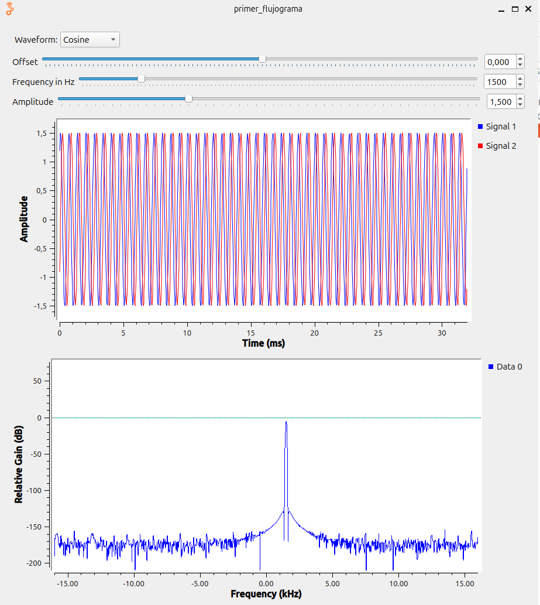 |
| SENO |  |
| DIENTE DE SIERRA | 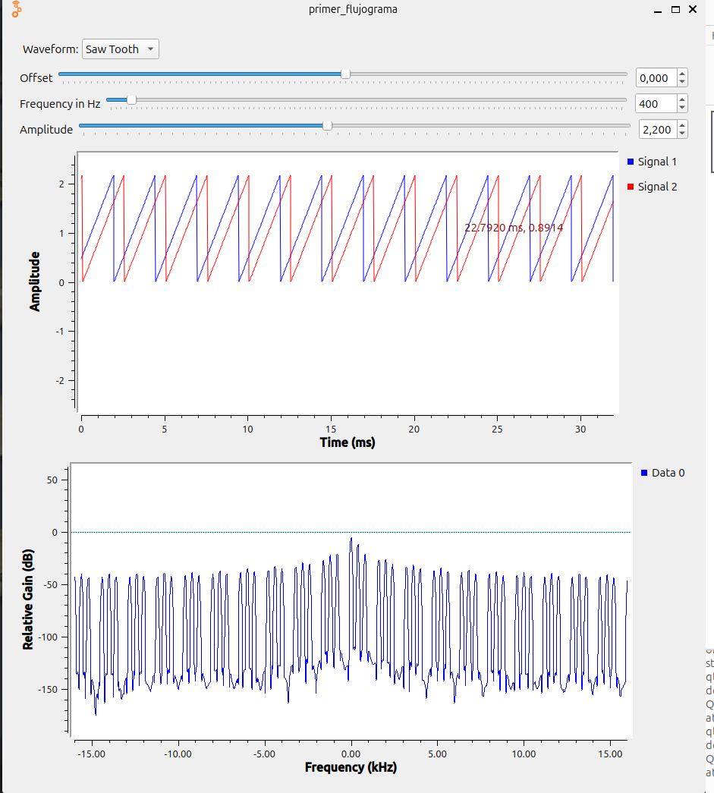 |
| CUADRADA |  |
| TRIANGULAR | 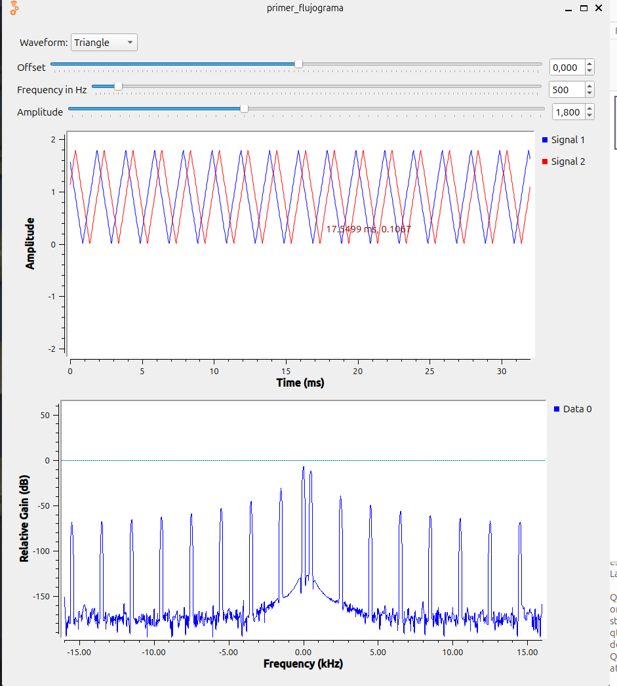 |

Diferentes variaciones en las señales

Para poder lograr una señal TRIANGULAR tipo flotante operando a una frecuencia de 4500 Hertz y amplitud 3, se tuvieron en cuenta los tipos de colores y sus datos correcpondientes para de esta manera identificando que, cuando el tipo de dato es ***Complex*** al trazarla en el dominio del tiempo, se nos muestra una componente real y una imaginaria, al tener el tipo de dato ***Float*** este solo nos muestra la componente real.

| Tipo de cambio en la señal | GNU Radio |
|-----------|-------|
| Señal seno operando a 100Hz, encontrando un pico en la respuesta de frecuencia en los 100Hz. | 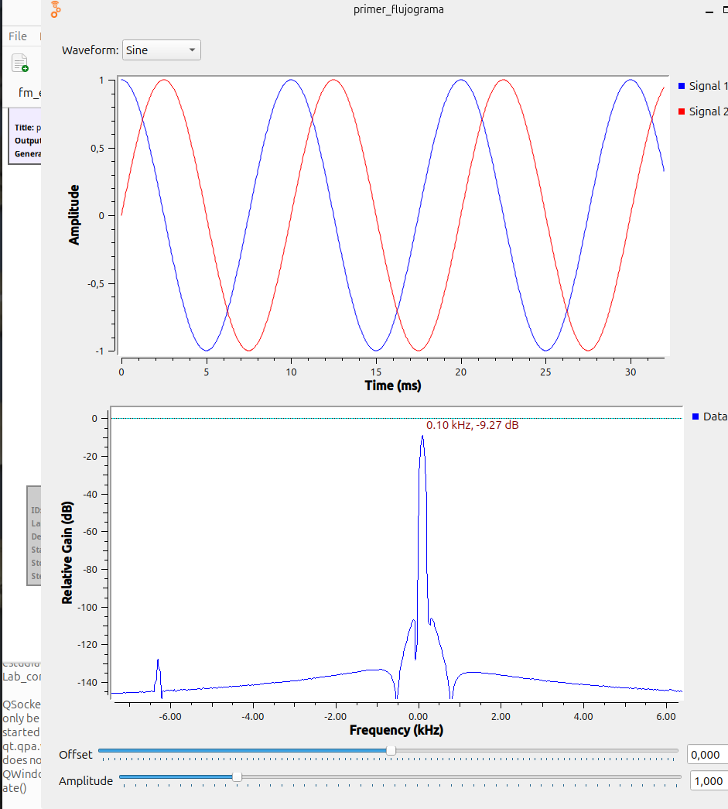 |
| Señal TRIANGULAR tipo flotante operando a una frecuencia de 4500 Hertz y amplitud 3 | 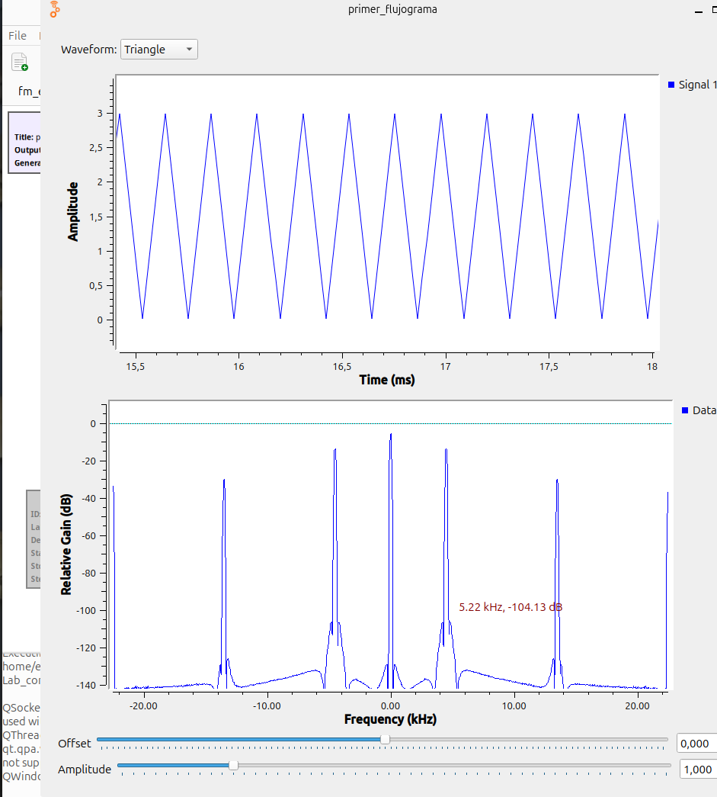 |

El offset en una señal es un voltaje constante que se suma a la señal, ya sea positivo o negativo, vamos a ver como afecta a nuestras señales generadas mediante GNU Radio

| Señal con offset | GNU Radio |
|-----------|-------|
| Constate | 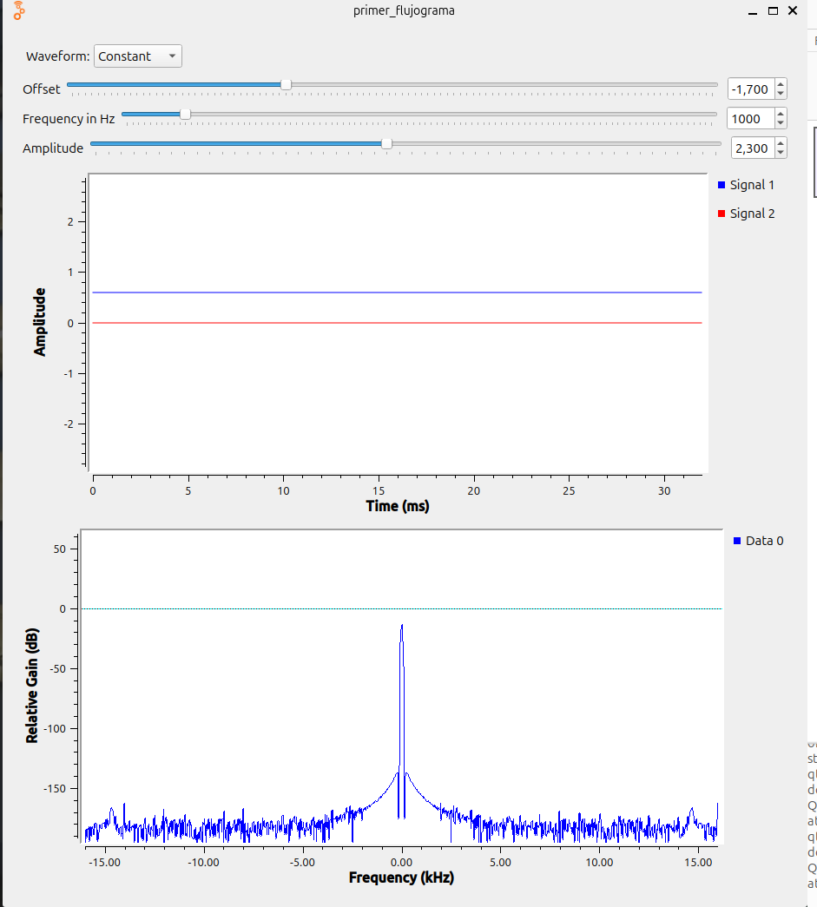 |
| Coseno |  |
| Triangular |  |

Efectos sobre la forma de onda cuando se tiene una relación de muestreo

| Relación de muestreo | GNU Radio |
|-----------|-------|
| samp_rate/Frequency = 5 | 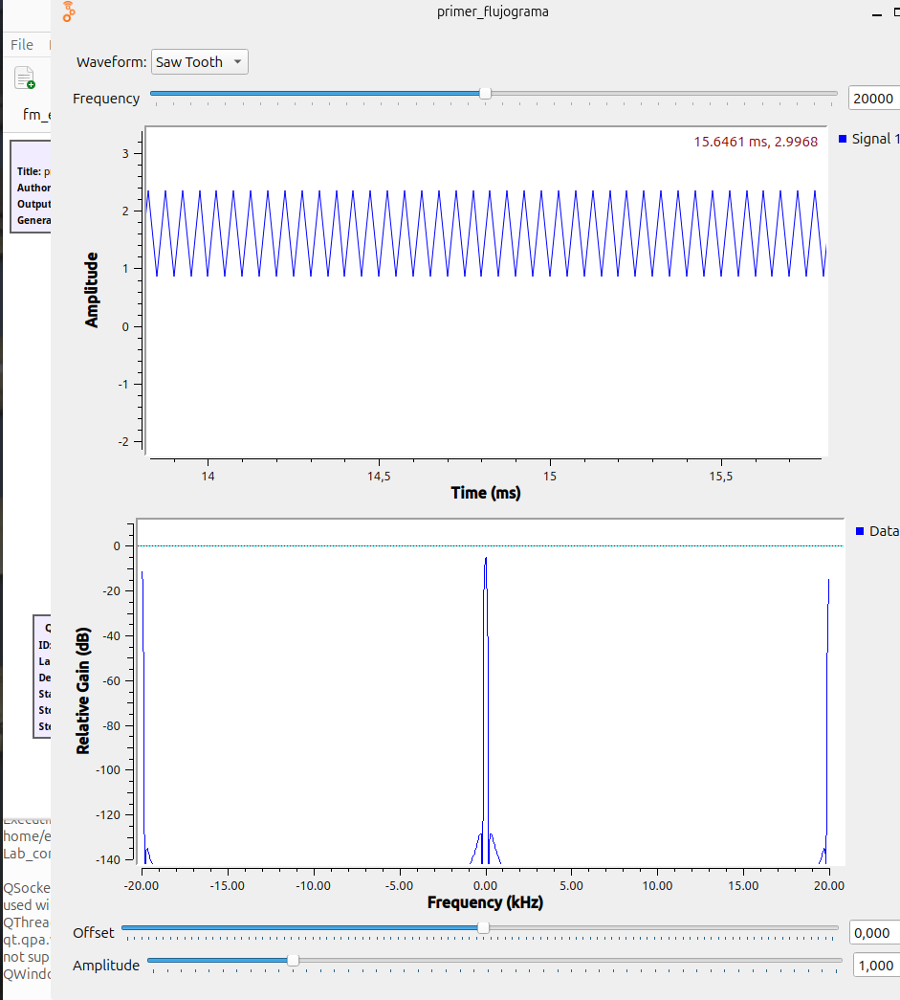 |
| samp_rate/frequency > 10 |  |

- ¿Cómo se alcanza el límite de Nyquist y que pasa cuando se disminuye de este?
Al alcanzar el limite se genera una disminucion en la informacion obtenida de la señal original, una vez se sigue disminuyendo la frecuencia de muestreo superando este limite se genera el aliasing lo cual hace que las frecuencias mas altas se reflejen en el espectro de frecuencias mas bajas.
- ¿Por qué al interpolar una señal en GNURADIO su frecuencia disminuye?
 Al interpolar una señal en GNURadio, se observa una disminución en su frecuencia debido al aumento en la tasa de muestreo. Este proceso expande el espectro de la señal y mejora su resolución en el dominio de la frecuencia, lo que resulta en una representación más detallada de la señal.
- ¿Por qué al diezmar una señal en GNURADIO su frecuencia aumenta?
Se observa un aumento en su frecuencia debido a la rediccion en la tasa de muestreo. Este proceso contrae el espectro de la señal y disminuyendo su resolución en el dominio de la frecuencia, lo que resulta en una representación menos detallada de la señal.
- ¿Cómo se puede determinar la frecuencia máxima de una señal desde lo experimental?
Para poder encontrar esta frecuencia maxima de una señal objetivo desde el laboratorio tenemos tanto el analizador de espectro como tambien osciloscopio digital, de los cuales podemos encontrar la frecuencia.
- Describa las funciones logradas con el Ecualizador desarrollado con GNURadio.
Experimentar con un ecualizador desarrollado con GNU Radio proporciona una comprensión profunda del funcionamiento de los filtros y sus efectos en la señal de audio. Permite ajustar y analizar las frecuencias de los filtros para observar cómo afectan a la señal de audio. Esto incluye la posibilidad de atenuar o realzar diferentes componentes de frecuencia, como voces o instrumentos musicales. Además, el ecualizador permite regular el volumen y explorar efectos de diezmado e interpolación en la señal. Esta experiencia práctica facilita el aprendizaje y la comprensión de los conceptos fundamentales del procesamiento de señales de audio.
### Conclusiones
Después de analizar el Teorema de Nyquist, se confirmó la importancia de respetar la frecuencia de muestreo adecuada para evitar pérdidas y distorsiones en una señal de audio. 
La visualización simultánea de las señales en el dominio del tiempo y la frecuencia facilitó la comprensión de los cambios producidos por los diferentes procesos y funciones aplicados, proporcionando una representación completa de la señal y sus características.
Se identificaron los efectos de interpolacion y diezmado, estos se pueden ejemplificar en señales de audio donde al momento de interpolar debido a la disminucion de la frecuencia la reproduccion del audio se relentiza, mientras que al diezmar la señal de audio esta se acelera debido al aumento en su frecuencia.
### Referencias
[1] Teorema de nyquist.” [Online]. Available:
https://techlib.net/techedu/teorema-de-nyquist/

[2]“Gnu radio.” [Online]. Available: 
https://wiki.gnuradio.org/index.php/Main_Page

### PRACTICA 1B: Reconociendo equipos
### Resumen
Se emplea un SDR (Software Defined Radio) como generador de señales y un osciloscopio para medir la amplitud de la señal transmitida, de esta manera se van a ir variando los valores de frecuencia y ganancia del transmisor para encontrar la amplitud medida experimentalmente con el osciloscopio en funcion de la amplitud dada desde al GNU Radio y respodiendo las preguntas **¿De que depende la precisión de medida en el osciloscopio?**, **Determine el porcentaje de amplitud de la señal recibida con respecto a la señal generada desde el PC**. Además, se estudia la atenuación en un cable coaxial RG58 A/U mediante un analizador de espectros, incorporando un atenuador de 30 dB

###Introducción

-De que depende la atenuacion de un cable
La atenuación en un cable coaxial se refiere a la disminución de la intensidad de la señal a medida que esta se propaga a lo largo del cable, por lo cual esta depende de la frecuencia de la señal transmitida, la longitud del cable cmo sus caracteristicas, el cable a utilizar durante la medicion de atenuacion en el laboratorio es el RG58 el cual cumple con tener perdidas minimas de intensidad para distancias menores a 15 metros.
-Un cable se puede considerar un filtro pasa-bajas
Este no se considera un filtro pasa bajas ya que su funcion no es filtrar las frecuencias de las señales, aunque este su puede atenuar las señales de frecuencias altas pudiento en ciertos casos comportarse como un filtro pasa bajas.


###Procedimiento

Una vez se a montado todos los bloques en el GNU Radio y conectandolos de manera tal que se pueda ganerar un buen funcionamiendo se procede a conectar el SDR al osciloscopio para que este pueda realizar las mediciones de amplitud que estamos necesitando, una vez todo se encuentre conectado de buena manera se procede a iniciar la simulación desde el GNU Radio para enviarle la informacion al SDR sobre la señal a generar, con esto se cambian los valores de Fc, GTX y amplitud generada obteniendo los datos y las imagenes de las siguientes tablas.
| FC = 200MHz | GTX = 10 | |
|-----------|-------|------------|
| *Amplitud generada* | *Amplitud medida en el osciloscopio* | *Señal observada* |
| 0.5 | 64 mV | 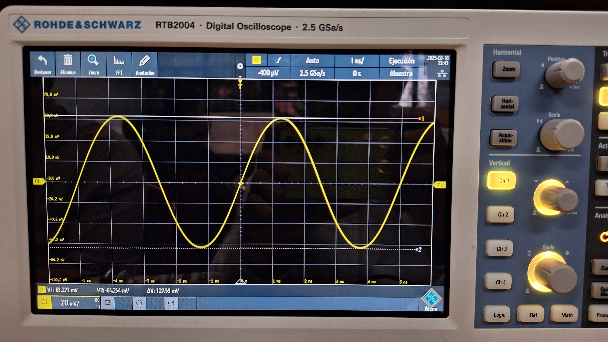 |
| 0.25 | 32.4 mV | 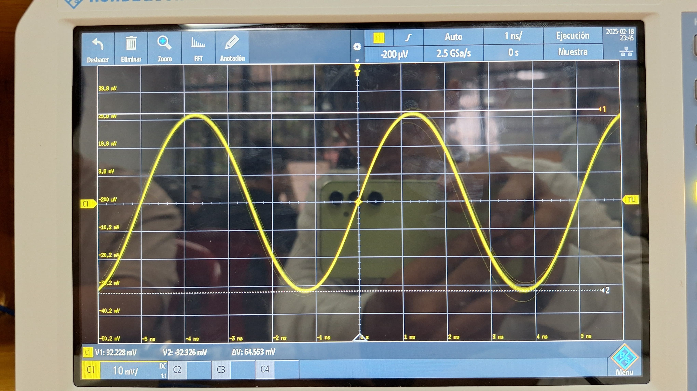 |
| 0.125 | 16.8 mV |  |
| 0.0625 | 8.5 mV |  |


| FC = 300MHz | GTX = 20 | |
|-----------|-------|------------|
| *Amplitud generada* | *Amplitud medida en el osciloscopio* | *Señal observada* |
| 0.5 | 99.96 mV | 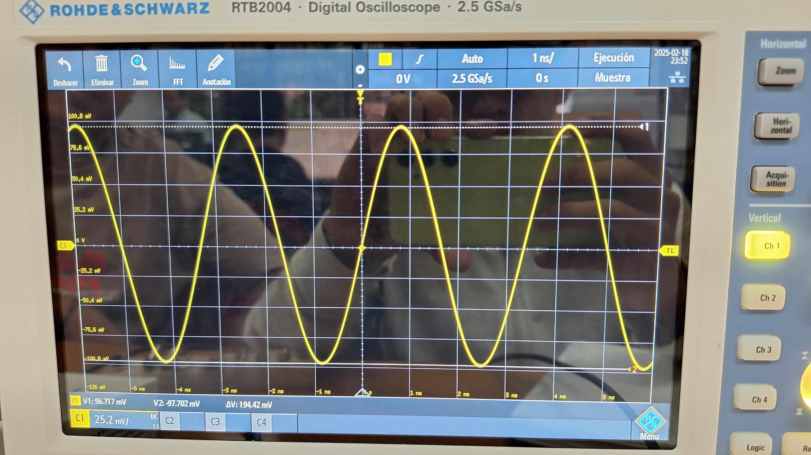 |
| 0.25 | 49.02 mV | 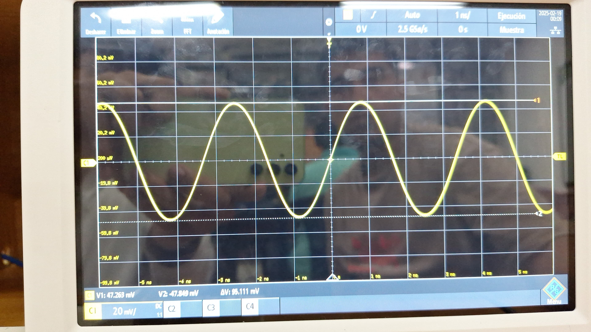 |
| 0.125 | 24.9 mV |  |
| 0.0625 | 12.5 mV |  |


| FC = 400MHz | GTX = 30 | |
|-----------|-------|------------|
| *Amplitud generada* | *Amplitud medida en el osciloscopio* | *Señal observada* |
| 0.5 | 150.06 mV |  |
| 0.25 | 83.4 mV |  |
| 0.125 | 42.54 mV | 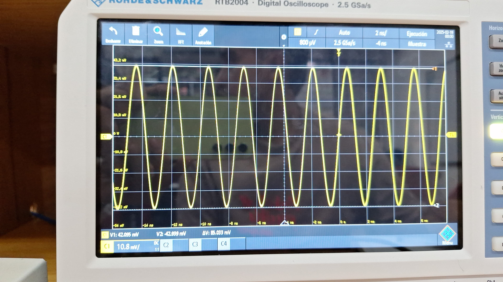 |
| 0.0625 | 21.63 mV |  |

¿De que depende la precisión de medida en el osciloscopio?
La precision de la medida del osciloscopio depende del uso que se le de principalmente, saber como acomodar la señal, modelarla de modo que nosotros podamos identificar mejores datos y formas con los que podamos obtener informacion, por ejemplo para medir picos de tension es mas preciso hacerlo con los ejes que nos brinda el osciloscopio, y ya otros factores externos podrian ser la calidad del cable con la que se trasmite la señal, una correcta manipulacion de los equipos para conectarlos entre si.

Determine el porcentaje de amplitud de la señal recibida con respecto a la señal generada desde el PC.
El porcentaje de amplitud de la señal recibida es aproximadamente entre el 80% y 90% se pierde señal por medio de la transmision, conexiones etc. una forma de saber es usando la siguiente formula Porcentaje=((Amplitud en GNU RadioAm /plitud en osciloscopio​))×100 

Al momento de medir la atenuación de un cable coaxial RG58 A/U utilizando un SDR como generador de señales y un analizador de espectros como equipo de medición, se debe realizar la conexión del sistema asegurando que el SDR esté correctamente vinculado al analizador de espectros mediante el cable coaxial, además se debe incluir un atenuador de 30 dB en la conexión con el objetivo de evitar la saturación en la medición. Una vez conectados los equipos, se procede a configurar el analizador de espectros ajustando sus variables para poder observar cada uno de los


### PRACTICA 1C


---
# Ejemplos usando Markdown

Volver al [INICIO](#laboratorio-de-comunicaciones)

## Inclusión de Imágenes
### Imagen de referencia dentro del repositorio:


### Imagen de fuente externa


### Uso de html para cambiar escala de la imagen


## Creación de hipevínculos 
- [Aprende Markdown](https://markdown.es/)
- [Más acerca de Markdown](https://docs.github.com/en/get-started/writing-on-github/getting-started-with-writing-and-formatting-on-github/basic-writing-and-formatting-syntax)
- [Abrir documento en el repositorio](my%20file/test_file.txt). Si hay espacios en la ruta de su archivo, reemplácelos por `%20`.
- Ir a una sección de este documento. Por ejemplo: [Ir a Contenido](#contenido) Tenga en cuenta escribir el título de la sección en minúsculas y los espacios reemplazarlos por guiones.
## Uso de Expresiones Matemáticas
Se pueden incluir ecuaciones en el archivo `README.md` utilizando sintaxis similar a [LaTeX](https://manualdelatex.com/tutoriales/ecuaciones):

### Ecuaciones en Línea
```
La energía de una señal exponencial es $E = \int_0^\infty A^2 e^{-2t/\tau} dt$.
```
**Salida renderizada:**
La energía de una señal exponencial es $E = \int_0^\infty A^2 e^{-2t/\tau} dt$.

### Ecuaciones en Bloque
```
$$E = \int_0^\infty A^2 e^{-2t/\tau} dt = \frac{A^2 \tau}{2}$$
```
**Salida renderizada**
$$E = \int_0^\infty A^2 e^{-2t/\tau} dt = \frac{A^2 \tau}{2}$$

## Creación de Tablas

**Tabla 1.** Ejemplo de tabla en Markdown.

| Parámetro | Valor |
|-----------|-------|
| Frecuencia (Hz) | 1000 |
| Amplitud (V) | 5 |
| Ciclo útil (%) | 50 |

## Inclusión de código

```python
def hello_world():
    print("Hello, World!")
```

También es posible resaltar texto tipo código como `print("Hello, World!")`.
Ejemplo de referencia:

- [Proakis, 2014] J. Proakis, M. Salehi. Fundamentals of communication systems. 2 ed. England: Pearson Education Limited, 2014. p. 164-165, 346. Chapter 5 In: [Biblioteca UIS](https://uis.primo.exlibrisgroup.com/permalink/57UIDS_INST/63p0of/cdi_askewsholts_vlebooks_9781292015699)

