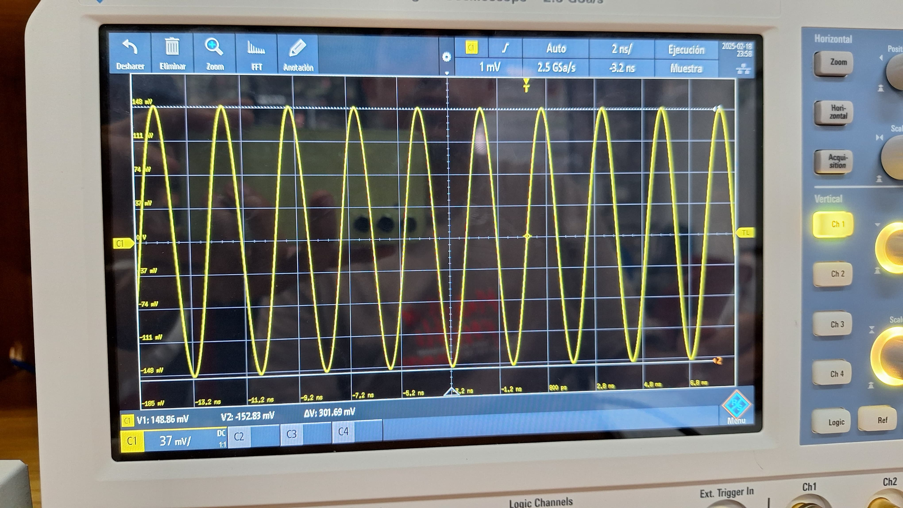

# Laboratorio de Comunicaciones
## Universidad Industrial de Santander

# Práctica 1

### Integrantes
- **OSCAR DANIEL CASTELLANOS MARIÑO** - 2205024
- **JUAN CAMILO GONZALEZ LEAL** - 2184682

Escuela de Ingenierías Eléctrica, Electrónica y de Telecomunicaciones  
Universidad Industrial de Santander

### Fecha
07 de marzo de 2025

---
### PRACTICA 1A: GNU Radio para el procesamiento de señales
### Resumen
Durante la práctica, se demostró el teorema de Nyquist, que vincula la frecuencia de muestreo con la señal para evitar el aliasing. Se utilizaron señales senoidales y cuadradas para ejemplificar los efectos del muestreo. Con GNU Radio, se diseñaron diagramas de bloques para procesar señales de audio. Se resaltó la necesidad de que la frecuencia de muestreo sea al menos el doble del ancho de banda de la señal.

**Palabras clave:** GNU Radio, Nyquist, Aliasing.

### Introducción
#### Uso de bloque THROTTLE:
Este desempeña un papel crucial en el control del flujo de datos en GNU Radio. Su función principal radica en regular la velocidad de procesamiento de los datos en el sistema. Esto es esencial para evitar la saturación del sistema, garantizando un procesamiento eficiente y sin pérdidas. 
#### Bloque QT GUI Frequency SINK:
Este proporciona información visual sobre las frecuencias presentes en la señal en tiempo real. Este bloque genera un espectrograma en tiempo real que muestra la distribución de las frecuencias en la señal en función del tiempo.
- ¿Qué tan importante es la teoría de muestreo en el procesamiento de señales?
Esta tiene su importancia debido a que de esta manera se puede encontrar informacion en las señales, ya que una frecuencia de muestreo no ideal puede llevar a la perdida de información y generando aliasing, es por esto que se tiene que la frecuencia de muestreo debe ser al mas de dos veces la frecuencia de la señal, a una mayor frecuencia de muestreo se tiene mas información de la señal original aunque esto lleva a una cantidad de datos.
- El teorema de Nyquist y su relación con el ancho de banda
El Teorema de Nyquist establece que la frecuencia de muestreo debe ser al menos el doble de la frecuencia de la señal para evitar el solapamiento y la distorsión de la información. Además, el teorema señala que la tasa máxima de transmisión de información a través de un canal está limitada por el ancho de banda del canal y el ruido. Por lo tanto, si transmitimos una señal con un ancho de banda mayor al ancho de banda del canal, perderemos información en el proceso de transmisión.
- El aliasing
Se refiere a la presencia de componentes de frecuencia falsos en la señal muestreada, lo que afecta la claridad y fidelidad del sonido. En casos extremos, el audio puede perderse por completo debido a la incapacidad de reconstruir correctamente la señal original.
- ¿Cuándo es importante interpolar una señal?
Cuando se necesita adaptar la señal a un receptor o con una tasa de muestreo especifica, reducir el aliasing y tambien mejorar la precision de medidas en sistemas de control

### Procedimiento
Debe basarse en las acciones efectivamente realizadas durante el laboratorio, describiendo los procesos realizados y los resultados obtenidos. Para cada práctica se pueden brindar preguntas orientadoras o pasos a seguir para establecer lo que se espera lograr/estudiar/analizar/obtener/comparar. Por ejemplo:
- Describa los procesos realizados en el laboratorio  y los resultados obtenidos.

Durante el reconocimiento del entorno de trabajo de GNU Radio las primeras señales que se obtuvieron diferentes con cambios en su frecuencia fueron seno, coceno, diente de sierra, triangular y cuadrada, de las cuales de cada una se puede observar su componente de amplitud con respecto al tiempo, asi como su ganancia relativa medida en dB con respecto a la frecuencia medida en KHz mostrando de esta manera la ***magnitud del espectro de frecuencia***
| Tipo de señal | GNU Radio |
|-----------|-------|
| COSENO |  |
| SENO |  |
| DIENTE DE SIERRA |  |
| CUADRADA |  |
| TRIANGULAR |  |

Diferentes variaciones en las señales

Para poder lograr una señal TRIANGULAR tipo flotante operando a una frecuencia de 4500 Hertz y amplitud 3, se tuvieron en cuenta los tipos de colores y sus datos correcpondientes para de esta manera identificando que, cuando el tipo de dato es ***Complex*** al trazarla en el dominio del tiempo, se nos muestra una componente real y una imaginaria, al tener el tipo de dato ***Float*** este solo nos muestra la componente real.

| Tipo de cambio en la señal | GNU Radio |
|-----------|-------|
| Señal seno operando a 100Hz, encontrando un pico en la respuesta de frecuencia en los 100Hz. |  |
| Señal TRIANGULAR tipo flotante operando a una frecuencia de 4500 Hertz y amplitud 3 |  |

El offset en una señal es un voltaje constante que se suma a la señal, ya sea positivo o negativo, vamos a ver como afecta a nuestras señales generadas mediante GNU Radio

| Señal con offset | GNU Radio |
|-----------|-------|
| Constate |  |
| Coseno |  |
| Triangular |  |

Efectos sobre la forma de onda cuando se tiene una relación de muestreo

| Relación de muestreo | GNU Radio |
|-----------|-------|
| samp_rate/Frequency = 5 |  |
| samp_rate/frequency > 10 |  |

- ¿Cómo se alcanza el límite de Nyquist y que pasa cuando se disminuye de este?
Al alcanzar el limite se genera una disminucion en la informacion obtenida de la señal original, una vez se sigue disminuyendo la frecuencia de muestreo superando este limite se genera el aliasing lo cual hace que las frecuencias mas altas se reflejen en el espectro de frecuencias mas bajas.
- ¿Por qué al interpolar una señal en GNURADIO su frecuencia disminuye?
 Al interpolar una señal en GNURadio, se observa una disminución en su frecuencia debido al aumento en la tasa de muestreo. Este proceso expande el espectro de la señal y mejora su resolución en el dominio de la frecuencia, lo que resulta en una representación más detallada de la señal.
- ¿Por qué al diezmar una señal en GNURADIO su frecuencia aumenta?
Se observa un aumento en su frecuencia debido a la rediccion en la tasa de muestreo. Este proceso contrae el espectro de la señal y disminuyendo su resolución en el dominio de la frecuencia, lo que resulta en una representación menos detallada de la señal.
- ¿Cómo se puede determinar la frecuencia máxima de una señal desde lo experimental?
Para poder encontrar esta frecuencia maxima de una señal objetivo desde el laboratorio tenemos tanto el analizador de espectro como tambien osciloscopio digital, de los cuales podemos encontrar la frecuencia.
- Describa las funciones logradas con el Ecualizador desarrollado con GNURadio.
Experimentar con un ecualizador desarrollado con GNU Radio proporciona una comprensión profunda del funcionamiento de los filtros y sus efectos en la señal de audio. Permite ajustar y analizar las frecuencias de los filtros para observar cómo afectan a la señal de audio. Esto incluye la posibilidad de atenuar o realzar diferentes componentes de frecuencia, como voces o instrumentos musicales. Además, el ecualizador permite regular el volumen y explorar efectos de diezmado e interpolación en la señal. Esta experiencia práctica facilita el aprendizaje y la comprensión de los conceptos fundamentales del procesamiento de señales de audio.
### Conclusiones
Después de analizar el Teorema de Nyquist, se confirmó la importancia de respetar la frecuencia de muestreo adecuada para evitar pérdidas y distorsiones en una señal de audio. 
La visualización simultánea de las señales en el dominio del tiempo y la frecuencia facilitó la comprensión de los cambios producidos por los diferentes procesos y funciones aplicados, proporcionando una representación completa de la señal y sus características.
Se identificaron los efectos de interpolacion y diezmado, estos se pueden ejemplificar en señales de audio donde al momento de interpolar debido a la disminucion de la frecuencia la reproduccion del audio se relentiza, mientras que al diezmar la señal de audio esta se acelera debido al aumento en su frecuencia.
### Referencias
[1] Teorema de nyquist.” [Online]. Available:
https://techlib.net/techedu/teorema-de-nyquist/

[2]“Gnu radio.” [Online]. Available: 
https://wiki.gnuradio.org/index.php/Main_Page

### PRACTICA 1B: Reconociendo equipos
### Resumen
Se emplea un SDR (Software Defined Radio) como generador de señales y un osciloscopio para medir la amplitud de la señal transmitida, de esta manera se van a ir variando los valores de frecuencia y ganancia del transmisor para encontrar la amplitud medida experimentalmente con el osciloscopio en funcion de la amplitud dada desde al GNU Radio y respodiendo las preguntas **¿De que depende la precisión de medida en el osciloscopio?**, **Determine el porcentaje de amplitud de la señal recibida con respecto a la señal generada desde el PC**. Además, se estudia la atenuación en un cable coaxial RG58 A/U mediante un analizador de espectros, incorporando un atenuador de 30 dB

###Introducción

-De que depende la atenuacion de un cable
La atenuación en un cable coaxial se refiere a la disminución de la intensidad de la señal a medida que esta se propaga a lo largo del cable, por lo cual esta depende de la frecuencia de la señal transmitida, la longitud del cable cmo sus caracteristicas, el cable a utilizar durante la medicion de atenuacion en el laboratorio es el RG58 el cual cumple con tener perdidas minimas de intensidad para distancias menores a 15 metros.
-Un cable se puede considerar un filtro pasa-bajas
Este no se considera un filtro pasa bajas ya que su funcion no es filtrar las frecuencias de las señales, aunque este su puede atenuar las señales de frecuencias altas pudiento en ciertos casos comportarse como un filtro pasa bajas.

###Procedimiento

Una vez se a montado todos los bloques en el GNU Radio y conectandolos de manera tal que se pueda ganerar un buen funcionamiendo se procede a conectar el SDR al osciloscopio para que este pueda realizar las mediciones de amplitud que estamos necesitando, una vez todo se encuentre conectado de buena manera se procede a iniciar la simulación desde el GNU Radio para enviarle la informacion al SDR sobre la señal a generar, con esto se cambian los valores de Fc, GTX y amplitud generada obteniendo los datos y las imagenes de las siguientes tablas.
| FC = 200MHz | GTX = 10 | |
|-----------|-------|------------|
| *Amplitud generada* | *Amplitud medida en el osciloscopio* | *Señal observada* |
| 0.5 | 64 mV |  |
| 0.25 | 32.4 mV |  |
| 0.125 | 16.8 mV |  |
| 0.0625 | 8.5 mV |  |

| FC = 300MHz | GTX = 20 | |
|-----------|-------|------------|
| *Amplitud generada* | *Amplitud medida en el osciloscopio* | *Señal observada* |
| 0.5 | 99.96 mV |  |
| 0.25 | 49.02 mV |  |
| 0.125 | 24.9 mV |  |
| 0.0625 | 12.5 mV |  |

| FC = 400MHz | GTX = 30 | |
|-----------|-------|------------|
| *Amplitud generada* | *Amplitud medida en el osciloscopio* | *Señal observada* |
| 0.5 | 150.06 mV |  |
| 0.25 | 83.4 mV |  |
| 0.125 | 42.54 mV |  |
| 0.0625 | 21.63 mV |  |

¿De que depende la precisión de medida en el osciloscopio?
La precision de la medida del osciloscopio depende del uso que se le de principalmente, saber como acomodar la señal, modelarla de modo que nosotros podamos identificar mejores datos y formas con los que podamos obtener informacion, por ejemplo para medir picos de tension es mas preciso hacerlo con los ejes que nos brinda el osciloscopio, y ya otros factores externos podrian ser la calidad del cable con la que se trasmite la señal, una correcta manipulacion de los equipos para conectarlos entre si.

Determine el porcentaje de amplitud de la señal recibida con respecto a la señal generada desde el PC.
El porcentaje de amplitud de la señal recibida es aproximadamente entre el 80% y 90% se pierde señal por medio de la transmision, conexiones etc. una forma de saber es usando la siguiente formula Porcentaje=((Amplitud en GNU RadioAm /plitud en osciloscopio​))×100 

Al momento de medir la atenuación de un cable coaxial RG58 A/U utilizando un SDR como generador de señales y un analizador de espectros como equipo de medición, se debe realizar la conexión del sistema asegurando que el SDR esté correctamente vinculado al analizador de espectros mediante el cable coaxial, además se debe incluir un atenuador de 30 dB en la conexión con el objetivo de evitar la saturación en la medición. Una vez conectados los equipos, se procede a configurar el analizador de espectros ajustando sus variables para poder observar cada uno de los cambios en la potencia.

| FC | GTX | Potencia entregada |
|-----------|-------|------------|
| 50 MHz | 6 |  |
| 100 MHz | 6 |  |
| 400 MHz | 27 |  |
| 990 MHz | 18 |  |

Se observa que la potencia recibida disminuye conforme aumenta la frecuencia de operación, lo que indica una mayor atenuación del cable a frecuencias más altas. Esto es evidente en la gráfica de "Potencia recibida", donde la potencia medida en el receptor disminuye progresivamente a medida que se incrementa la frecuencia.

La atenuación del cable, representada en la segunda gráfica, muestra un comportamiento creciente con la frecuencia. A frecuencias bajas, la atenuación es menor, mientras que a frecuencias altas, la atenuación es significativamente mayor, lo que sugiere una mayor pérdida en la transmisión de la señal a frecuencias más elevadas.

### Conclusiones
Durante el transcurso de esta practica se puedo evidenciar que la precisión de la medición en el osciloscopio depende de varios factores, incluyendo la resolución del equipo, la calibración de los canales, la correcta configuración de la escala vertical y horizontal, la calidad de las conexiones y la presencia de ruido en el sistema.

La relación entre la amplitud medida en el osciloscopio y la amplitud generada desde el PC varía dependiendo de la frecuencia de operación y la ganancia del transmisor. Si la atenuación no es constante en todas las mediciones, se puede atribuir a la pérdida en el cable coaxial, las características de propagación en el medio, la impedancia de los dispositivos conectados y posibles interferencias externas.

La atenuación del cable coaxial aumenta con la frecuencia, lo que indica mayores pérdidas de señal a frecuencias más altas.
### Referencias

[1]“Gnu radio.” [Online]. Available: 
https://wiki.gnuradio.org/index.php/Main_Page

### PRACTICA 1C: Mediciones de potencia y frecuencia

Objetivo General
Familiarizarse con el uso de herramientas de software definido por radio (SDR) como GNU Radio, junto con equipos de medición como el USRP 2920, el osciloscopio R&S RTB2004 y el analizador de espectros R&S FPC1000. Los estudiantes aprenderán a medir y analizar parámetros clave en comunicaciones, como potencia, ancho de banda, relación señal a ruido (SNR) y piso de ruido.

### Actividad 1: Revisión de Especificaciones de los Equipos

Objetivo
Familiarizarse con las especificaciones técnicas de los equipos de laboratorio y entender cómo configurarlos para realizar mediciones.

¿Cuál es el rango de frecuencia del USRP 2920 y cómo se compara con el del analizador de espectros?

Rango de frecuencia del Analizador de Espectros R&S FPC1000:
El R&S FPC1000 cubre un rango de 5 Hz a 1 GHz. Este rango es más limitado que el del USRP 2920, pero es adecuado para aplicaciones de análisis de señales RF en el espectro inferior a media frecuencia.

| Componente | Rango de frecuencia | Rango de ganancia |
|-----------|-------|------------|
| Recepción (RX Frontend) | 68.750 MHz a 2200.000 MHz | Ganancia PGA0: 0.0 dB a 31.5 dB (paso de 0.5 dB) |
| Transmisión (TX Frontend) | 68.750 MHz a 2200.000 MHz | Ganancia PGA0: 0.0 dB a 31.0 dB (paso de 1.0 dB) |
| Recepción (RX Codec) | - | Ganancia Digital: 0.0 dB a 6.0 dB (paso de 0.5 dB) |

El USRP 2920 tiene un rango de frecuencia mayor que el analizador de espectros R&S FPC1000 (2.2 GHz frente a 1 GHz).
El USRP está diseñado para transmisión y recepción de señales, mientras que el analizador de espectros se enfoca en la medición y análisis de señales en un rango más específico.

¿Qué parámetros del USRP 2920 se deben configurar para transmitir una señal en una frecuencia específica?
Para transmitir una señal en una frecuencia específica con el USRP 2920, se deben configurar los siguientes parámetros:
*Frecuencia de transmisión (TX Frequency)*
*Ancho de banda de muestreo (Sampling Rate)*
*Amplitud de la señal*
*Modulación*
*Ganancia de transmisión (TX Gain)*

¿Cómo se configura el osciloscopio para medir la amplitud y la frecuencia de una señal?

Para medir la amplitud y la frecuencia de una señal en un osciloscopio, primero conecta la señal al canal de entrada para luego justar la base de tiempo (Time Base) para visualizar al menos un ciclo completo de la señal, modificando el tiempo por división en el eje horizontal, se ajusta la escala de voltaje (Vertical Scale) para que la amplitud sea claramente visible. 
Para medir la frecuencia, puedes contar los ciclos completos en la pantalla y multiplicarlos por la frecuencia de la base de tiempo, o usar las herramientas automáticas del osciloscopio, la amplitud se observa la diferencia entre el valor máximo y mínimo en el eje vertical, utilizando la medición de pico a pico proporcionada por el equipo.

¿Qué diferencia hay entre medir una señal en el dominio del tiempo (osciloscopio) y en el dominio de la frecuencia (analizador de espectros)?

| Medicion | - |
|-----------|-------|
| Dominio del tiempo (Osciloscopio) | Mide como varia una señal en el tiempo, es útil para observar las formas de onda de señales, ver transitorios y estudiar cómo cambian las señales. |
| Dominio de la frecuencia (Analizador de espectros) | Mide cómo se distribuyen las frecuencias en una señal, es útil para ver las frecuencias dominantes en una señal, detectar distorsión armónica, medir la potencia en diferentes bandas de frecuencia y analizar la ocupación del espectro. |

¿Cómo se mide el piso de ruido en el analizador de espectros? ¿Cómo afecta la frecuencia central, SPAN y RBW la medida de piso de ruido? ¿Por qué?

Evidencia

Lista con las 5 especificaciones más relevantes de cada equipo.

| Equipo | Especificaciones |
|-----------|-------|
| USRP 2920 | Frecuencia de operación: 50 MHz a 2.2 GHz. Ancho de banda de muestreo: 25 MS/s. Modulación: Soporta modulación digital y analógica. Conectividad: Dos puertos de RF (entradas/salidas) con conectores SMA. Interfaz: Conexión USB 3.0 para la transferencia de datos entre el dispositivo y un PC, compatible con plataformas como GNU Radio. |
| Osciloscopio R&S RTB2004 | Frecuencia de muestreo: 2 Gsample/s. Ancho de banda: 70 MHz. Pantalla: Pantalla táctil capacitiva de 10,1 pulgadas. Canales: 4 canales analógicos. Profundidad de memoria: Hasta 10 Mpts por canal. |
| Analizador de Espectros R&S FPC1000 | Rango de frecuencia: 5 Hz a 1 GHz. Análisis en tiempo real: Capacidad para realizar análisis de espectro en tiempo real y visualizar el espectro de señales. Resolución de ancho de banda: Ancho de banda de resolución de 1 Hz. Sensibilidad de la señal: Rango de detección de -150 dBm. Pantalla: Pantalla de 7 pulgadas a color. |

Se realizó la mediciones de piso ruido, quedando como evidencia las siguientes imagenes

### Actividad 2: Simulación de Señales en GNU Radio

Objetivo
Generar y analizar señales en GNU Radio para entender cómo se comportan diferentes formas de onda en tiempo y frecuencia.

Procedimiento
Iniciar GNU Radio:

Ejecute GNU Radio Companion (GRC) (gnuradio-companion).
Cargue el flujograma simple_flowgraph.grc.
Identifique los bloques principales: Signal Source, Throttle, QT GUI Time Sink y QT GUI Frequency Sink.
Configure la frecuencia de muestreo (samp_rate) en 20 kHz.
Ejecutar el Flujograma:

Ejecute el flujograma y observe los diferentes controles (Source Controls, Channel Controls, USRP Controls), así como las señales generadas en las ventanas de tiempo (Time Sink) y frecuencia (Frequency Sink).
Identifique y relacione los bloques presentes en el flujograma con lo observado en la ventana de ejecución.
Análisis de Señales

Analice y valide los resultados en el dominio del tiempo y de frecuencia si se modifica:
el tipo de dato de la fuente (compleja o flotante)
la forma de onda
la frecuencia y fase de la señal
la amplitud de la señal generada.
Modifique el nivel de ruido del modelo de canal y analice el efecto en tiempo y frecuencia.
Preguntas Orientadoras
¿Cómo se puede explicar matemáticamente la diferencia entre una fuente de tipo flotante y una de tipo complejo?
¿Cómo afecta la forma de onda a la distribución de energía (potencia) en el dominio de la frecuencia?
¿Qué sucede con la señal en el dominio del tiempo y la frecuencia si se modifican los diferentes parámetros de la fuente? ¿Lo observado corresponde a lo esperado teóricamente?
¿Cómo se relaciona la amplitud de la señal con la potencia observada en el dominio de la frecuencia?
¿Qué diferencias se observan entre una señal senoidal y una señal cuadrada en el dominio de la frecuencia?
Evidencias
Capturas de pantalla de señales generadas en el dominio del tiempo y la frecuencia que evidencien cada una de las comparaciones realizadas.

### Actividad 3: Transmisión y Medición de Señales con el USRP 2920

Objetivo
Transmitir señales usando el USRP 2920 y medir parámetros clave como potencia, ancho de banda, piso de ruido y relación señal a ruido (SNR).

Procedimiento
Configurar el USRP 2920:

Configure el flujograma en GNU Radio para transmitir una señal a través del USRP. Habilite o deshabilite los bloques correspondientes (Channel Model, Throttle, UHD: USRP Sink, Virtual Sink). Para esto seleccione el bloque deseado y presionando E (enable) o D (disable), respectivamente.
Identifique el bloque de frecuencia de muestreo (samp_rate) y observe el efecto de cambiar su valor (e.g. 10 kHz).
Configure la frecuencia de muestreo (samp_rate) en 1 MHz.
Verifique el efecto de modificar la frecuencia y ganancia del USRP.
Medición con el Analizador de Espectros:

Conecte la salida del USRP al analizador de espectros.
Mida el piso de ruido normalizado a la frecuencia de portadora que va a utilizar.
Compare el espectro de la señal observada en el analizador de espectros con la observada en la pantalla de simulación. Tenga en cuenta que el radio (USRP) equivale al diagrama de bloques mostrado en la figura.
QAM Modulator

Analice y valide los resultados en el dominio de la frecuencia si se modifica:
el tipo de dato de la fuente (compleja o flotante)
la forma de onda
la frecuencia y fase de la señal
la amplitud de la señal generada.
Mida potencia de la señal transmitida y ancho de banda de diferentes señales generadas.
Conecte una antena apropiada a la entrada del analizador de espectros y observe el espectro de una señal FM (las estaciones FM se sitúan entre los 88 MHz y 108 MHz). Mida su ancho de banda y relación señal a ruido.
Determinar la máxima potencia de transmisión.
Evalúe la respuesta en frecuencia del canal midiendo los cambios de ganancia del sistema cuando varía la frecuencia de portadora.
Compare los resultados de transmitir usando un cable y usando antenas.
Medición con el Osciloscopio:
Analice y valide los resultados en el dominio del tiempo si se modifica:
el tipo de dato de la fuente (compleja o flotante)
la forma de onda
la frecuencia y fase de la señal
la amplitud de la señal generada.
Contraste estos resultados con los obtenidos con el analizador de espectros.
Cálculo de la Relación Señal a Ruido (SNR):
Usar las mediciones de potencia y piso de ruido para calcular la SNR de algunas de las señales generadas.
Anotar el valor de la SNR en dB.
Preguntas Orientadoras
¿Cómo se configura el USRP 2920 para transmitir una señal en una frecuencia específica?
¿Qué parámetros del flujograma afectan la potencia de la señal transmitida?
¿Cómo se mide el ancho de banda de la señal transmitida en el analizador de espectros?
¿Cómo se calcula la relación señal a ruido (SNR) a partir de las mediciones de potencia y piso de ruido?
¿Qué diferencias se observan en las mediciones de potencia cuando se varía la ganancia del USRP?
¿Es posible medir o estimar la potencia de la señal observada en el osciloscopio? ¿Por qué?
Evidencia
Capturas de pantalla de señales generadas en el dominio del tiempo y la frecuencia que evidencien las principales comparaciones realizadas.
Captura de la señal FM usada para medición de ancho de banda.

### Actividad 4: Análisis de Resultados y Conclusiones

Objetivo
Analizar los resultados obtenidos y sacar conclusiones sobre el comportamiento de las señales en diferentes condiciones para elaborar el informe.

Para la Elaboración del Informe
Comparar Resultados:

Compare los resultados obtenidos en las simulaciones y las transmisiones reales.
Discuta las diferencias entre las mediciones realizadas con el osciloscopio y el analizador de espectros.
Reflexionar sobre la SNR:

Analice la importancia de la relación señal a ruido (SNR) en las comunicaciones inalámbricas.
Discuta cómo el piso de ruido afecta la capacidad de detectar señales débiles.
Conclusiones Finales:

Escriba conclusiones basadas en los resultados obtenidos.
Reflexe sobre las limitaciones de los equipos y cómo se podrían mejorar las mediciones.
Preguntas Orientadoras
¿Qué conclusiones se pueden obtener sobre la relación entre la potencia de la señal y la calidad de la comunicación?
¿Cómo afecta el piso de ruido a la capacidad de detectar señales débiles?
¿Qué limitaciones tienen los equipos utilizados en términos de ancho de banda y precisión en las mediciones?
¿Cómo se pueden mejorar las mediciones de señal en un entorno con alto nivel de ruido?
¿Qué aplicaciones prácticas tienen las mediciones de potencia y ancho de banda en sistemas de comunicaciones reales?
¿Cómo se puede medir la respuesta en frecuencia de un canal alámbrico?
¿Cómo se puede obtener un modelo sencillo de las pérdidas (pathloss) en un canal inalámbrico?

---
