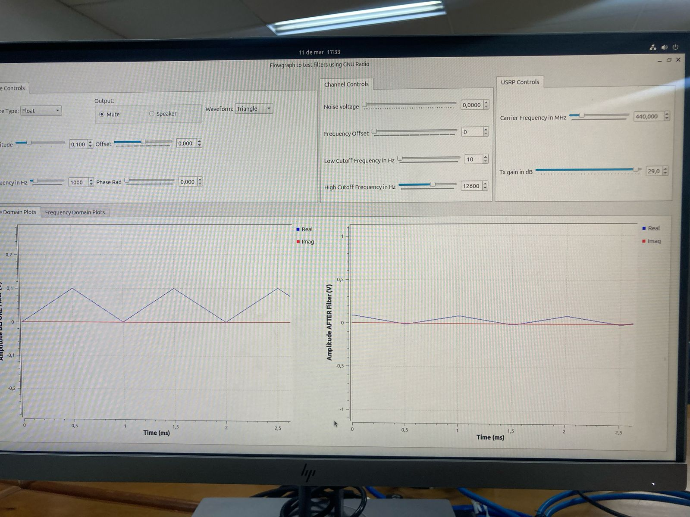
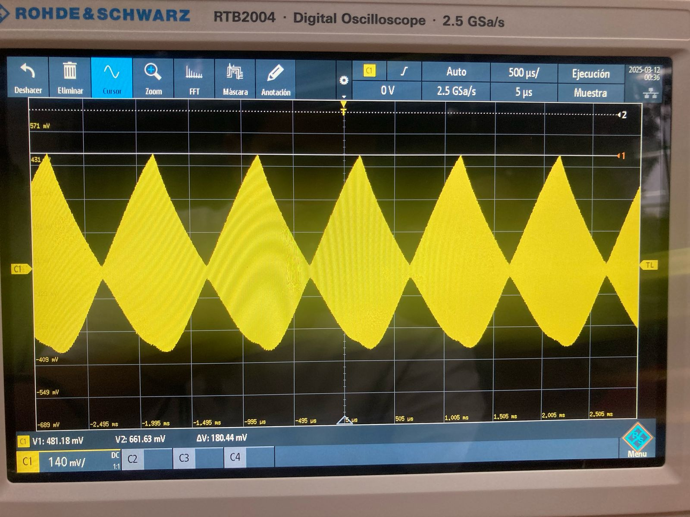
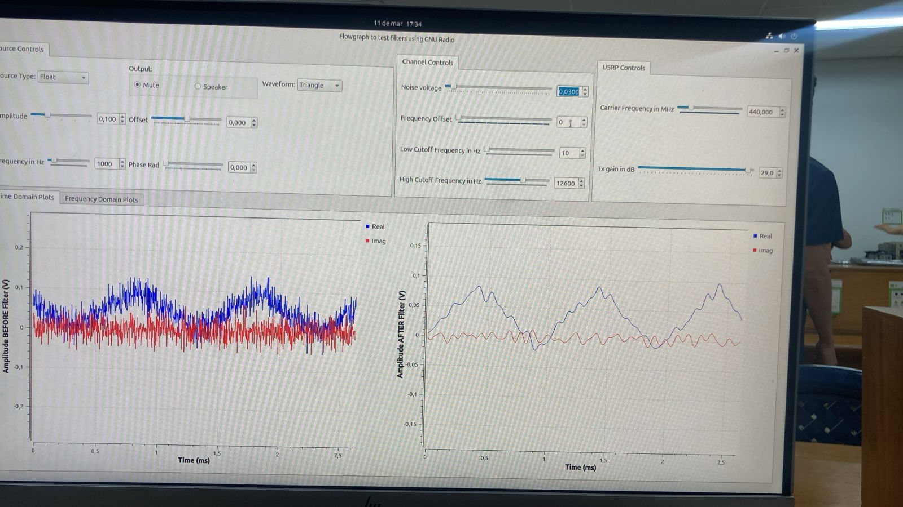
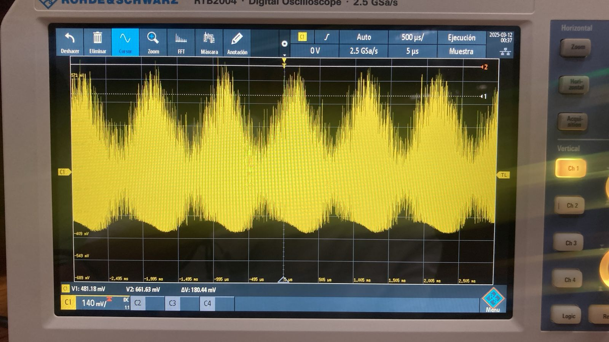
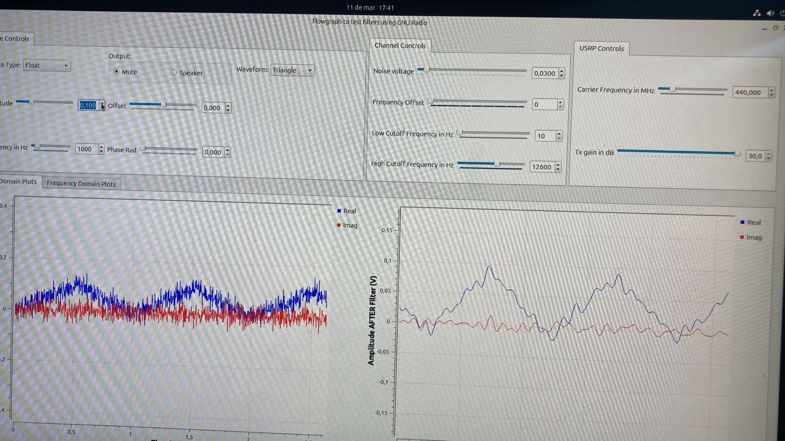
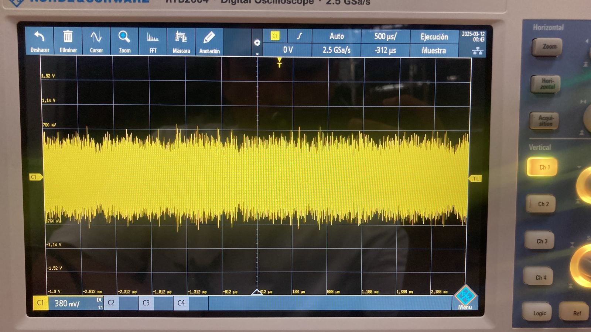
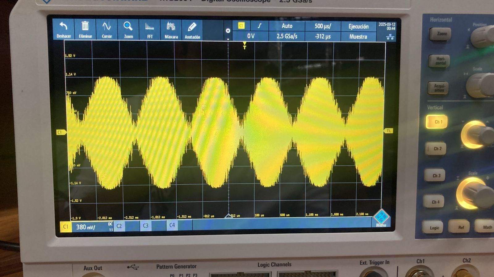
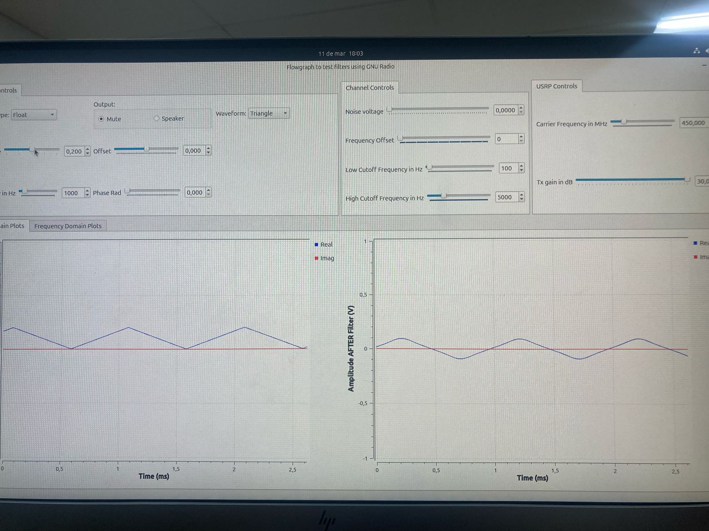
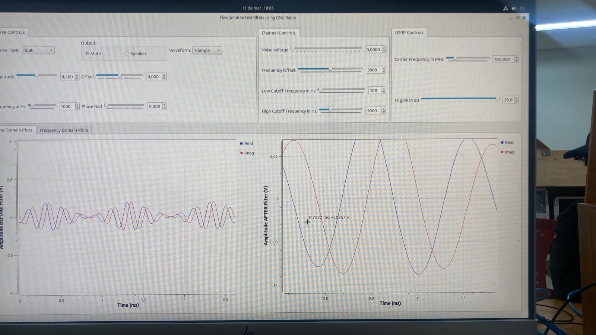

# Laboratorio de Comunicaciones
## Universidad Industrial de Santander

# Práctica 2

### Integrantes
- **OSCAR DANIEL CASTELLANOS MARIÑO** - 2205024
- **JUAN CAMILO GONZALEZ LEAL** - 2184682

Escuela de Ingenierías Eléctrica, Electrónica y de Telecomunicaciones  
Universidad Industrial de Santander

### Fecha
21 de marzo de 2025
### PRACTICA 2A:Fenómenos de canal en el osciloscopio

**Objetivo**
Familiarizarse con los fenómenos de un canal alámbrico real en el dominio del tiempo.

### Procedimiento
Para esta practica tomamos n=6 y configuramos la simulacion y hardware de acuerdo a lo dicho en la practica. para poder visualizar los diferentes fenomenos en el osciloscopio.

1. **Configurar el USRP 2920:**
   - Configurar el flujograma [filters_flowgraph.grc](filters_flowgraph.grc) en GNU Radio para transmitir una señal a través del USRP.
   - Habilitar o deshabilitar los bloques correspondientes (`Channel Model`, `Throttle`, `UHD: USRP Sink`, `UHD: USRP Source`, `Virtual Sink`). Para esto, seleccione el bloque deseado y presione **E** (enable) o **D** (disable), según corresponda.
   - Configurar siempre la frecuencia de muestreo (`samp_rate`) en $25e6/2^n$ Hz`, donde $n$ es un número entero mayor a 2. Verifique que la frecuencia de muestreo durante la ejecución, sea la misma que ha configurado en el flujograma.

2. **Configurar el osciloscopio:**
   - Encender, configurar y conectar el osciloscopio a la salida del USRP 2920 usando diferentes cables coaxiales, y ajustando los parámetros necesarios para evidenciar los fenómenos de canal analizados en la Actividad 1.
   - Variar la frecuencia de portadora del USRP entre 50 MHz hasta 500 MHz y anaalizar los resultados.
  
   **Nota: nuestro USRP solo permite hasta los 400 Mhz**

   ### Preguntas Orientadoras

**-¿Cuál es el efecto del ruido sobre la amplitud de las señales medidas en el osciloscopio? ¿Conservan las mismas relaciones que se evidencian en la simulación?:**
El efeco el cual logramos identificar en la amplitud es que al inducir ruido artificial a la señal a travez del programa, en nuestro osciloscopio la amplitud aumentaba al igual que en el simulador por lo tanto si conserva las mismas relaciones. 
como se evidencia su amplitud aumenta un delta, por eso pusimos 2 marcadores para saber cuanto aumentaba este delta, en este caso 180.44 mv

| Señal | Señal sin ruido (simulador) | Señal sin ruido (osciloscopio) | Señal con ruido (simulador)| Señal con ruido (osciloscopio) |
|-------|----------------------|--------------------------------|----------------------------|---------------------------------------|
| TRIANGULAR |  |  |  |  |

**¿La relación señal a ruido creada intencionalmente en el computador se amplifica o se reduce en la señal observada en el osciloscopio?:** La relacion señal a ruido creada desde el simulador se vera menor o sea se reduce y en el osciloscopio se peor o se identifica menos ya que el ruido intenta ser parte de la señal. en la siguiente pregunta se ve como se mejora la imagen de la señal a partir de una señal que no se podria identificar por el ruido 

**Demuestre ¿cómo se puede mejorar la relación señal a ruido en una señal?:** La relacion señal a ruido se puede mejorar al aumentar su amplitud desde el simulador ya que si aumento la amplitud directamente aumenta la potencia de la señal y se podra identificar mejor ya que la potencia de la señal es proporcional al cuadrado de la amplitud. para nuestro caso lo mejoramos con una amplitud de 0.3

| Señal | Señal con ruido (simulador) | Señal con ruido (osciloscopio) | Señal con ruido mejorada (simulador)| Señal con ruido mejorada (osciloscopio) |
|-------|-----------------------------|--------------------------------|-------------------------------------|-----------------------------------------|
| TRIANGULAR |  |  |  |  |

**¿Cómo se evidencia el fenómeno de desviación de frecuencia en el osciloscopio? Evidenciar al menos con dos formas de onda:** Lo que se logra evidenciar de este fenomeno es que la señal al aumentar esta desviacion de frecuencia aumenta un poco sus picos por lo tanto aumento su amplitud muy poco pero se bede a que la señal se comprime o se expande un poco debido a la desviacion de frecuencia 

| Señal | Señal sin desviacion (simulador) | Señal sin desviacion (osciloscopio) | Señal con desviacion (simulador)| Señal con desviacion (osciloscopio) |
|-------|----------------------------------|-------------------------------------|---------------------------------|-------------------------------------|
| CUADRADA |  |  |  |  |
| TRIANGULAR |  |  |  |  |

**Determine la afectación de un medio de transmisión coaxial (usar cables largos) sobre una señal periódica operando a las capacidades máximas de muestreo del USRP.**
  - **NOTA:** La frecuencia de transmisión no debe superar los 500 MHz para ser observada en el osciloscopio. Para el experimento, considere las relaciones de muestreo correspondientes.
**Usando cables coaxiales de diferentes longitudes, ¿cómo afecta la distancia entre el transmisor y el receptor a la amplitud de la señal medida?**

**Usando antenas, ¿cómo afecta la distancia entre el transmisor y el receptor a la amplitud de la señal medida? ¿Es posible compensar el fenómeno?**

**¿Qué modelo de canal básico describe mejor las mediciones obtenidas en la práctica?**
