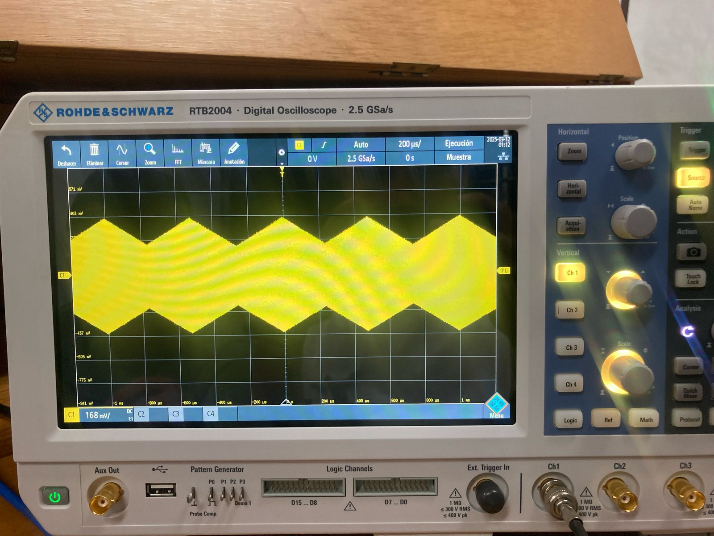
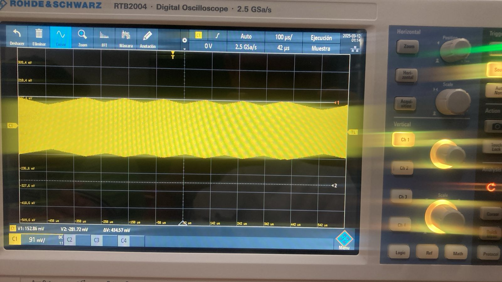
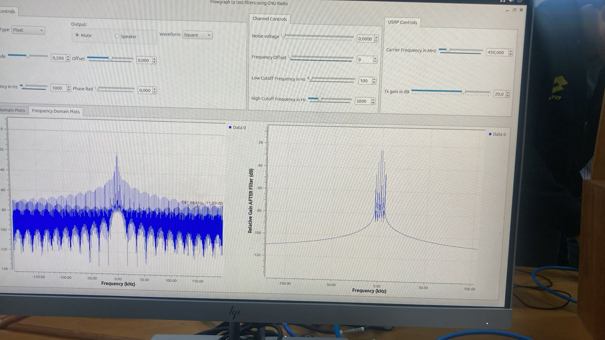
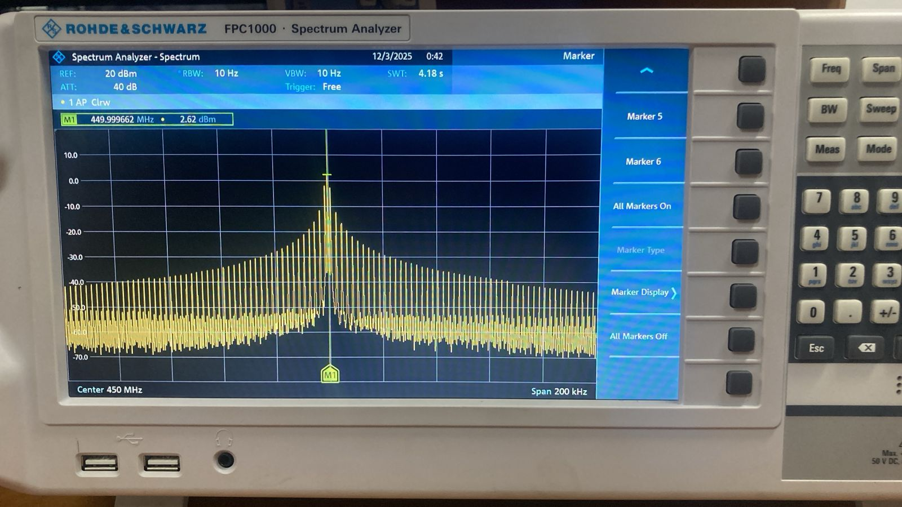
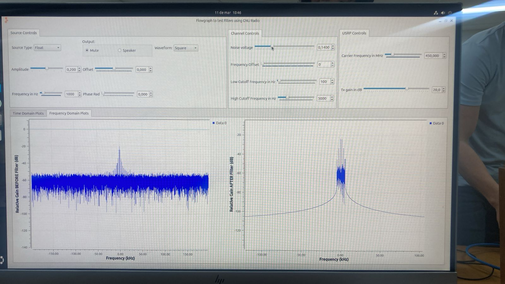
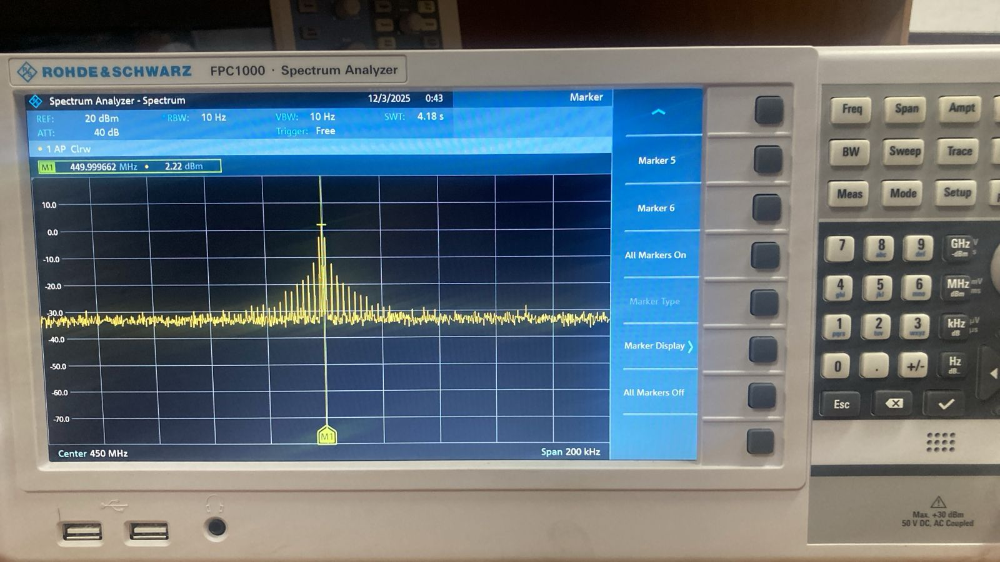

## Actividad 1: Actividades de simulación de canal en GNU Radio

### Objetivo

Familiarizarse con algunos fenómenos de canal en un ambiente simulado.

### Procedimiento

**Simulación**
   - Verificar equipos y elementos a utilizar (revisar manuales de ser necesario)
   - Cargar el flujograma: [filters_flowgraph.grc](filters_flowgraph.grc).
   - Configurar siempre la frecuencia de muestreo (`samp_rate`) en $25e6/2^n$ Hz`, donde $n$ es un número entero mayor a 2.
   - Genere diferentes señales y observe el efecto de variar las frecuencias de corte del filtro.
   - Analice el efecto del ruido en el dominio del tiempo y la frecuencia para al menos dos formas de onda distintas.
   - Muestre con un ejemplo gráfico el umbral de máximo de ruido ante el cual considera que es posible recuperar cada forma de onda utilizando únicamente filtrado.

### Preguntas Orientadoras

- ¿Cuál es el efecto de filtrar las frecuencias altas de una señal?
- ¿Qué sucede al filtrar muy cerca de la frecuencia fundamental de la señal?
- ¿Cuál es el efecto de filtrar las frecuencias bajas de una señal?
- ¿Qué ocurre al eliminar armónicos de una señal?
- ¿Qué efecto tiene la desviación de frecuencia en la señal recibida? ¿Qué efecto(s) produce el filtro cuando la señal recibida se ve afectada por desviación de frecuencia?
- ¿Cómo cuantificar la degradación de la señal al aumentar los niveles de ruido?
- ¿Cómo se puede mejorar la relación señal a ruido en una señal?
- ¿Cómo podría cuantificar la calidad de la señal recibida? Considere el caso de señales analógicas y digitales.

### Evidencia

*(Adjuntar las evidencias de la práctica en el Aula Virtual: capturas de pantalla, observaciones, cálculos o mediciones preliminares)*

---

### PRACTICA 2B:Fenómenos de canal en el osciloscopio

**Objetivo**
Familiarizarse con los fenómenos de un canal alámbrico real en el dominio del tiempo.

### Procedimiento
Para esta practica tomamos n=6 y configuramos la simulacion y hardware de acuerdo a lo dicho en la practica. para poder visualizar los diferentes fenomenos en el osciloscopio.

1. **Configurar el USRP 2920:**
   - Configurar el flujograma [filters_flowgraph.grc](filters_flowgraph.grc) en GNU Radio para transmitir una señal a través del USRP.
   - Habilitar o deshabilitar los bloques correspondientes (`Channel Model`, `Throttle`, `UHD: USRP Sink`, `UHD: USRP Source`, `Virtual Sink`). Para esto, seleccione el bloque deseado y presione **E** (enable) o **D** (disable), según corresponda.
   - Configurar siempre la frecuencia de muestreo (`samp_rate`) en $25e6/2^n$ Hz`, donde $n$ es un número entero mayor a 2. Verifique que la frecuencia de muestreo durante la ejecución, sea la misma que ha configurado en el flujograma.

2. **Configurar el osciloscopio:**
   - Encender, configurar y conectar el osciloscopio a la salida del USRP 2920 usando diferentes cables coaxiales, y ajustando los parámetros necesarios para evidenciar los fenómenos de canal analizados en la Actividad 1.
   - Variar la frecuencia de portadora del USRP entre 50 MHz hasta 500 MHz y anaalizar los resultados.
  
   **Nota: nuestro USRP solo permite hasta los 400 Mhz**

   ### Preguntas Orientadoras

**-¿Cuál es el efecto del ruido sobre la amplitud de las señales medidas en el osciloscopio? ¿Conservan las mismas relaciones que se evidencian en la simulación?:**
El efeco el cual logramos identificar en la amplitud es que al inducir ruido artificial a la señal a travez del programa, en nuestro osciloscopio la amplitud aumentaba al igual que en el simulador por lo tanto si conserva las mismas relaciones. 
como se evidencia su amplitud aumenta un delta, por eso pusimos 2 marcadores para saber cuanto aumentaba este delta, en este caso 180.44 mv

| Señal | Señal sin ruido (simulador) | Señal sin ruido (osciloscopio) | Señal con ruido (simulador)| Señal con ruido (osciloscopio) |
|-------|----------------------|--------------------------------|----------------------------|---------------------------------------|
| TRIANGULAR |  |  |  |  |

**¿La relación señal a ruido creada intencionalmente en el computador se amplifica o se reduce en la señal observada en el osciloscopio?:** La relacion señal a ruido creada desde el simulador se vera mayor visualmente y en  el osciloscopio se ve relativamente mal o se identifica menos ya que el ruido intenta ser parte de la señal. en la siguiente pregunta se ve como se mejora la imagen de la señal a partir de una señal que no se podria identificar por el ruido 

**Demuestre ¿cómo se puede mejorar la relación señal a ruido en una señal?:** La relacion señal a ruido se puede mejorar al aumentar su amplitud desde el simulador ya que si aumento la amplitud directamente aumenta la potencia de la señal y se podra identificar mejor ya que la potencia de la señal es proporcional al cuadrado de la amplitud. para nuestro caso lo mejoramos con una amplitud de 0.3

| Señal | Señal con ruido (simulador) | Señal con ruido (osciloscopio) | Señal con ruido mejorada (simulador)| Señal con ruido mejorada (osciloscopio) |
|-------|-----------------------------|--------------------------------|-------------------------------------|-----------------------------------------|
| TRIANGULAR |  |  |  |  |

**¿Cómo se evidencia el fenómeno de desviación de frecuencia en el osciloscopio? Evidenciar al menos con dos formas de onda:** Lo que se logra evidenciar de este fenomeno es que la señal al aumentar esta desviacion de frecuencia aumenta un poco sus picos por lo tanto aumento su amplitud muy poco pero se bede a que la señal se comprime o se expande un poco debido a la desviacion de frecuencia 

| Señal | Señal sin desviacion (simulador) | Señal sin desviacion (osciloscopio) | Señal con desviacion (simulador)| Señal con desviacion (osciloscopio) |
|-------|----------------------------------|-------------------------------------|---------------------------------|-------------------------------------|
| CUADRADA |  |  |  |  |
| TRIANGULAR |  |  |  |  |

**Determine la afectación de un medio de transmisión coaxial (usar cables largos) sobre una señal periódica operando a las capacidades máximas de muestreo del USRP.**
  - **NOTA:** La frecuencia de transmisión no debe superar los 500 MHz para ser observada en el osciloscopio. Para el experimento, considere las relaciones de muestreo correspondientes.
**Usando cables coaxiales de diferentes longitudes, ¿cómo afecta la distancia entre el transmisor y el receptor a la amplitud de la señal medida?:**  Las capacidades maximas de muestreo para nuestro USRP son de 450 MHz. para esto configuramos la frecuecnia carrier en 450 MHz usamos primero un cable corto de aproximadamente de 60 cm t en el otro caso usamos uno largo de aproximadamente de 27 metros.
Esta distancia atenua la señal entre el trasmisor y receptor reduciendo la amplitud de la señal, aplanando mas la señal y siedno un poco mas dificl de analizarla.
Entonces podemos concluir que la afectacion del medio de trasmision afecta directamente la amplitud de la señal entre mas argo sea mas la atenuara 

| Señal con cable corto | Señal con cable largo |
|-----------------------|-----------------------|
|  |  |

**Usando antenas, ¿cómo afecta la distancia entre el transmisor y el receptor a la amplitud de la señal medida? ¿Es posible compensar el fenómeno?:** La distancia afecta directamente la señal entre el trasmisor y receptor entre mas distancia halla entre estos dos la calidad de la señal trasmitida se ira degradando lo mismo si algun objeto se interpone entre el camino de estas dos, para hacer una mejor trasmision se deben colocar en paralelo y no de frente. 
[Ver video en YouTube](https://www.youtube.com/shorts/KtmKC7uHtfA)

**¿Qué modelo de canal básico describe mejor las mediciones obtenidas en la práctica?:** Consideramos que el modelo de canal mediante cable (alambrico ) es mejor para esta aplicacion, pero pues debemos tener en cuenta que estamos en un entorno casi que controaldo con las mejores condiciones por esto podemos recibir mejores respuesta o precision de las mediciones, pero el otro medio tambien se puede manejar de buena manera y dar buenas respuestas. todo depende de la aplicacion que se le vaya a dar de esta manera escogemos cual es mejor.

### PRACTICA 2C:Fenómenos de canal en el analizador de espectro

**Objetivo**
Familiarizarse con los fenómenos de un canal alámbrico real en el dominio de la frecuencia.

### Procedimiento
Para esta practica tomamos n=6 y configuramos la simulacion y hardware de acuerdo a lo dicho en la practica. para poder visualizar los diferentes fenomenos en el osciloscopio.

1. **Configurar el USRP 2920:**
   - Configurar el flujograma [filters_flowgraph.grc](filters_flowgraph.grc) en GNU Radio para transmitir una señal a través del USRP.
   - Habilitar o deshabilitar los bloques correspondientes (`Channel Model`, `Throttle`, `UHD: USRP Sink`, `UHD: USRP Source`, `Virtual Sink`). Para esto, seleccione el bloque deseado y presione **E** (enable) o **D** (disable), según corresponda.
   - Configurar siempre la frecuencia de muestreo (`samp_rate`) en $25e6/2^n$ Hz`, donde $n$ es un número entero mayor a 2. Verifique que la frecuencia de muestreo durante la ejecución, sea la misma que ha configurado en el flujograma.

2. **Configurar el Analizador de Espectros:**
   - configurar y conectar el analizador de espectros a la salida del USRP 2920 usando diferentes cables coaxiales, y ajustando los parámetros necesarios para evidenciar los fenómenos de canal analizados en la Actividad 1.
   - Variar la frecuencia de portadora del USRP entre 50 MHz hasta 500 MHz y anaalizar los resultados.
  
   **Nota: nuestro USRP solo permite hasta los 400 Mhz**

   ### Preguntas Orientadoras

**- ¿Cuál es el efecto del ruido sobre la respuesta en frecuencia de las señales medidas en el analizador de espectro? ¿Conservan las mismas relaciones que se evidencian en la simulación?:**
El efeco el cual logramos identificar es que el piso de ruido se sube, por ejemplo sin aplicarle ruido el piso de ruido esta en arpoximadamente -80db y aplicandole un ruido de 0.144 voltaje de ruido vemos que se sube 20 db 

| Señal | Señal sin ruido (simulador) | Señal sin ruido (analizador ) | Señal con ruido (simulador)| Señal con ruido (analizador) |
|-------|----------------------|--------------------------------|----------------------------|---------------------------------------|
| CUADRADA |  |  |  |  |

**¿La relación señal a ruido creada intencionalmente desde el computador se amplifica o se reduce en la señal observada en el analizador de espectro?:** La relacion señal  ruido creada intencionalmente se refleja en el analizador de espectros mas pequeña. es inversa a lo visto en el osciloscopio 

**Demuestre ¿cómo se puede mejorar la relación señal a ruido en una señal?:** La relacion señal a ruido se puede mejorar al aumentar su amplitud desde el simulador ya que si aumento la amplitud directamente aumenta la potencia de la señal y se podra identificar mejor ya que la potencia de la señal es proporcional al cuadrado de la amplitud. para nuestro caso lo mejoramos con una amplitud de 0.3

| Señal | Señal con ruido (simulador) | Señal con ruido (osciloscopio) | Señal con ruido mejorada (simulador)| Señal con ruido mejorada (osciloscopio) |
|-------|-----------------------------|--------------------------------|-------------------------------------|-----------------------------------------|
| TRIANGULAR |  |  |  |  |

**¿Cómo se evidencia el fenómeno de desviación de frecuencia en el osciloscopio? Evidenciar al menos con dos formas de onda:** Lo que se logra evidenciar de este fenomeno es que la señal al aumentar esta desviacion de frecuencia aumenta un poco sus picos por lo tanto aumento su amplitud muy poco pero se bede a que la señal se comprime o se expande un poco debido a la desviacion de frecuencia 

| Señal | Señal sin desviacion (simulador) | Señal sin desviacion (osciloscopio) | Señal con desviacion (simulador)| Señal con desviacion (osciloscopio) |
|-------|----------------------------------|-------------------------------------|---------------------------------|-------------------------------------|
| CUADRADA |  |  |  |  |
| TRIANGULAR |  |  |  |  |

**Determine la afectación de un medio de transmisión coaxial (usar cables largos) sobre una señal periódica operando a las capacidades máximas de muestreo del USRP.**
  - **NOTA:** La frecuencia de transmisión no debe superar los 500 MHz para ser observada en el osciloscopio. Para el experimento, considere las relaciones de muestreo correspondientes.
**Usando cables coaxiales de diferentes longitudes, ¿cómo afecta la distancia entre el transmisor y el receptor a la amplitud de la señal medida?:**  Las capacidades maximas de muestreo para nuestro USRP son de 450 MHz. para esto configuramos la frecuecnia carrier en 450 MHz usamos primero un cable corto de aproximadamente de 60 cm t en el otro caso usamos uno largo de aproximadamente de 27 metros.
Esta distancia atenua la señal entre el trasmisor y receptor reduciendo la amplitud de la señal, aplanando mas la señal y siedno un poco mas dificl de analizarla.
Entonces podemos concluir que la afectacion del medio de trasmision afecta directamente la amplitud de la señal entre mas argo sea mas la atenuara 

| Señal con cable corto | Señal con cable largo |
|-----------------------|-----------------------|
|  |  |

**Usando antenas, ¿cómo afecta la distancia entre el transmisor y el receptor a la amplitud de la señal medida? ¿Es posible compensar el fenómeno?:** La distancia afecta directamente la señal entre el trasmisor y receptor entre mas distancia halla entre estos dos la calidad de la señal trasmitida se ira degradando lo mismo si algun objeto se interpone entre el camino de estas dos, para hacer una mejor trasmision se deben colocar en paralelo y no de frente. 
[Ver video en YouTube](https://www.youtube.com/shorts/KtmKC7uHtfA)

**¿Qué modelo de canal básico describe mejor las mediciones obtenidas en la práctica?:** Consideramos que el modelo de canal mediante cable (alambrico ) es mejor para esta aplicacion, pero pues debemos tener en cuenta que estamos en un entorno casi que controaldo con las mejores condiciones por esto podemos recibir mejores respuesta o precision de las mediciones, pero el otro medio tambien se puede manejar de buena manera y dar buenas respuestas. todo depende de la aplicacion que se le vaya a dar de esta manera escogemos cual es mejor.

## Actividad 4: Efectos de los fenómenos de canal en la conversión de frecuencia

### Objetivo

Familiarizarse con los efectos de los fenómenos de un canal alámbrico e inalámbrico real en la conversión de frecuencia.

### Procedimiento

**Configurar el USRP 2920:**
   - Configurar el flujograma [filters_flowgraph.grc](filters_flowgraph.grc) en GNU Radio para **transmitir y recibir ** una señal a través del USRP.
   - Habilitar o deshabilitar los bloques correspondientes (`Channel Model`, `Throttle`, `UHD: USRP Sink`, `UHD: USRP Source`, `Virtual Sink`). Para esto, seleccione el bloque deseado y presione **E** (enable) o **D** (disable), respectivamente.
   - Configurar siempre la frecuencia de muestreo (`samp_rate`) en $25e6/2^n$ Hz`, donde $n$ es un número entero mayor a 2. Verifique que la frecuencia de muestreo durante la ejecución, sea la misma que ha configurado en el flujograma.
   - Compare los resultados al recibir la señal usando diferentes medios (aire o cable coaxial).

### Preguntas Orientadoras

- ¿Cómo se evidencian los diferentes fenómenos de canal en la señal recibida?
- ¿Cómo se pueden mitigar los efectos del canal en la señal recibida?

### Evidencia

*(Adjuntar las evidencias de la práctica en el Aula Virtual: capturas de pantalla, observaciones, cálculos o mediciones preliminares)*

