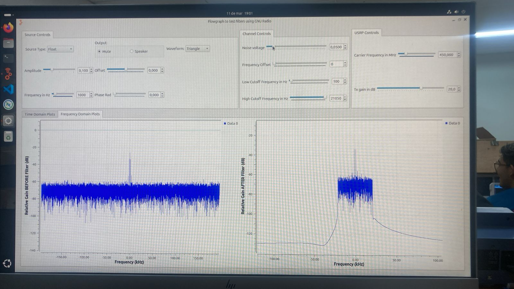
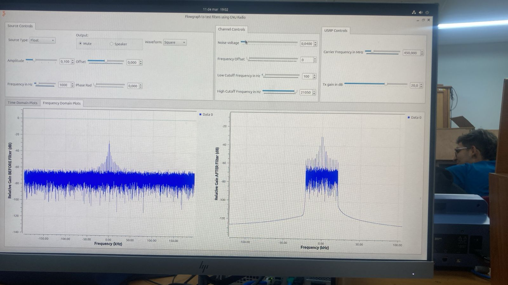
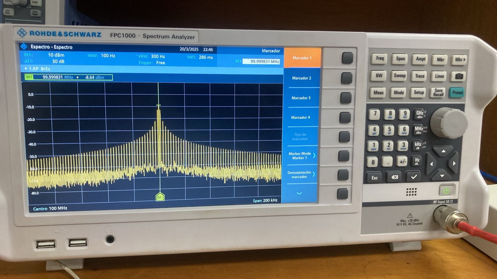
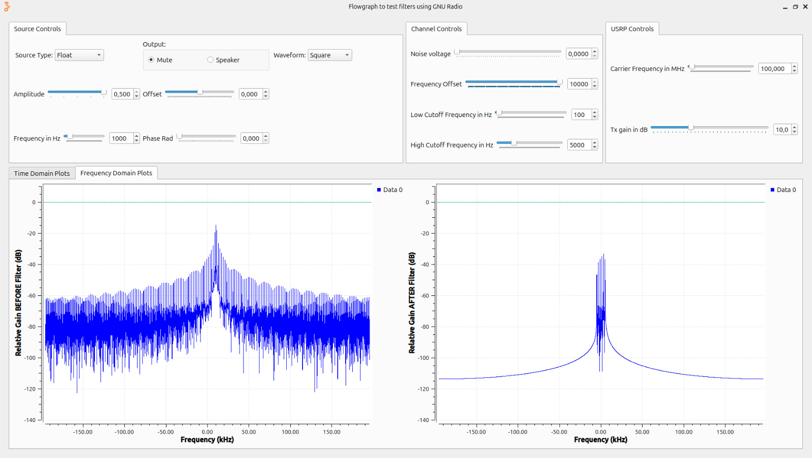

## Actividad 1: Actividades de simulación de canal en GNU Radio

### Objetivo

Familiarizarse con algunos fenómenos de canal en un ambiente simulado.

### Procedimiento

**Simulación**
   - Verificar equipos y elementos a utilizar (revisar manuales de ser necesario)
   - Cargar el flujograma: [filters_flowgraph.grc](filters_flowgraph.grc).
   - Configurar siempre la frecuencia de muestreo (`samp_rate`) en $25e6/2^n$ Hz`, donde $n$ es un número entero mayor a 2.
   - Genere diferentes señales y observe el efecto de variar las frecuencias de corte del filtro.
   - Analice el efecto del ruido en el dominio del tiempo y la frecuencia para al menos dos formas de onda distintas.
   - Muestre con un ejemplo gráfico el umbral de máximo de ruido ante el cual considera que es posible recuperar cada forma de onda utilizando únicamente filtrado.

### Preguntas Orientadoras

- ¿Cuál es el efecto de filtrar las frecuencias altas de una señal?

Cuando se eliminan las frecuencias altas de una señal periódica mediante un filtro pasa-bajas, la señal resultante pierde detalles y se suaviza. Esto ocurre porque los armónicos de alta frecuencia contienen la información sobre los cambios bruscos en la forma de onda. Si el filtrado es extremo, la señal puede convertirse en una onda senoidal pura con la frecuencia fundamental.

Al tener una señal triangular de 2kHz esta posee varios armónicos los cuales se encuentran en 2kHz, 6kHz, 10kHz y 14kHz con esto podemos colocar un filtro pasa banda el cual va a tener una frecuencia de corte en 1kHz y vamos a ir variando la frecuencia de corte alta hasta los 4kHz, haciendo esta variación podemos observar como la señal se va suavizando llegando a observarse como una sinusoidal ya que luego del filtrado en el corte de 4 kHz solo se puede observar el primer armónico.

- ¿Qué sucede al filtrar muy cerca de la frecuencia fundamental de la señal

La señal se comienza a perder picos haciendo que se suavice la señal, de esta manera, si la señal fundamental esta en 900Hz y la frecuencia de corte baja se encuentra en 1kHz, la señal se atenua y se pierde informacion, es por esto que se presenta en la parte izquierda de la visualizacion de la simulacion en el GNU radio.

- ¿Cuál es el efecto de filtrar las frecuencias bajas de una señal?

Al aplicar un filtro pasa-altas, se eliminan las frecuencias bajas, incluyendo la fundamental, esto hace que la señal pierda su estructura principal y se transforme en una señal de alta frecuencia con menos contenido energético. En el caso extremo, la señal podría degradarse en solo ruido o picos abruptos.

- ¿Qué ocurre al eliminar armónicos de una señal?

Si se eliminan los primeros armónicos y se mantienen solo los de alta frecuencia, la señal resultante tendrá una apariencia más dentada o errática, ya que los armónicos superiores contribuyen a los detalles finos. Esto puede ser útil en aplicaciones como el análisis de bordes en imágenes o en la detección de transitorios en señales eléctrica, ahora si se eliminan todos los armonicos de una señal esta deja ser observada.

- ¿Qué efecto tiene la desviación de frecuencia en la señal recibida? ¿Qué efecto(s) produce el filtro cuando la señal recibida se ve afectada por desviación de frecuencia?

### Caso 1: Modulación en Frecuencia (FM)

•	En la modulación en frecuencia (FM), la frecuencia de la señal portadora varía en función de la señal moduladora.
•	Si la señal de entrada es una onda senoidal de baja frecuencia, la frecuencia de la portadora oscila alrededor de su frecuencia central.

### Caso 2: Inestabilidad en un Oscilador (Drift de Frecuencia)
•	Los osciladores usados en transmisores o receptores pueden cambiar de frecuencia debido a cambios de temperatura, envejecimiento de componentes o interferencias electromagnéticas.

| Efecto del filtro ante una desviación de frecuencia | |
|---|---|
| Atenuación de la señal | Si la desviación de frecuencia es lo suficientemente grande, parte de la señal puede quedar fuera del ancho de banda del filtro, causando una disminución de la potencia de la señal recibida. |
| Distorsión de fase | Los filtros pueden introducir retardos de fase que afectan la alineación temporal de la señal. |
| Pérdida de información en sistemas modulados | En sistemas con modulación digital o analógica, la pérdida de componentes de frecuencia esenciales debido a la acción del filtro puede resultar en una recuperación incorrecta de la información original. |

- ¿Cómo cuantificar la degradación de la señal al aumentar los niveles de ruido?

Para cuantificar la degradación de una señal conforme aumenta el ruido, se emplea principalmente la relación señal a ruido (SNR, Signal-to-Noise Ratio), que se expresa en decibeles (dB).

 SNR = 10 log (Pseñal/Pruido) [ dB ]

 A medida que el ruido aumenta, el SNR disminuye, lo que indica una mayor degradación de la señal. Otra métrica útil en comunicaciones digitales es la tasa de error de bits (BER, Bit Error Rate), que mide la fracción de bits recibidos incorrectamente en comparación con el total transmitido. En el caso de señales analógicas, se puede analizar la relación señal a distorsión y ruido (SINAD, Signal-to-Noise and Distortion Ratio) o la relación de error cuadrático medio (MSE, Mean Squared Error) con respecto a una señal de referencia.

- ¿Cómo se puede mejorar la relación señal a ruido en una señal?

| Mejora de la relación señal a ruido en una señal | |
|---|---|
| Aumentar la potencia de la señal transmitida | Si la señal es más fuerte en comparación con el ruido, el receptor podrá interpretarla con mayor claridad. |
| Usar filtros adecuados | los filtros pasa-bajas, pasa-altas o pasa-banda pueden eliminar componentes de ruido en frecuencias no deseadas. | 
| Uso de antenas direccionales o mejoras en la transmisión | En sistemas inalámbricos, el uso de antenas de mayor ganancia o diversificación espacial puede mejorar el SNR. |

- ¿Cómo podría cuantificar la calidad de la señal recibida? Considere el caso de señales analógicas y digitales.

Para señales analógicas:

*SNR (Signal-to-Noise Ratio)*

*SINAD (Signal-to-Noise and Distortion Ratio)*

*THD (Total Harmonic Distortion)*

*MSE (Mean Squared Error) o PSNR (Peak Signal-to-Noise Ratio)*

Para señales digitales:

*BER (Bit Error Rate)*

*EVM (Error Vector Magnitude)*

*MER (Modulation Error Ratio)*

*Tasa de paquetes perdidos (Packet Loss Rate)*

### PRACTICA 2B:Fenómenos de canal en el osciloscopio

**Objetivo**
Familiarizarse con los fenómenos de un canal alámbrico real en el dominio del tiempo.

### Procedimiento
Para esta practica tomamos n=6 y configuramos la simulacion y hardware de acuerdo a lo dicho en la practica. para poder visualizar los diferentes fenomenos en el osciloscopio.

1. **Configurar el USRP 2920:**
   - Configurar el flujograma [filters_flowgraph.grc](filters_flowgraph.grc) en GNU Radio para transmitir una señal a través del USRP.
   - Habilitar o deshabilitar los bloques correspondientes (`Channel Model`, `Throttle`, `UHD: USRP Sink`, `UHD: USRP Source`, `Virtual Sink`). Para esto, seleccione el bloque deseado y presione **E** (enable) o **D** (disable), según corresponda.
   - Configurar siempre la frecuencia de muestreo (`samp_rate`) en $25e6/2^n$ Hz`, donde $n$ es un número entero mayor a 2. Verifique que la frecuencia de muestreo durante la ejecución, sea la misma que ha configurado en el flujograma.

2. **Configurar el osciloscopio:**
   - Encender, configurar y conectar el osciloscopio a la salida del USRP 2920 usando diferentes cables coaxiales, y ajustando los parámetros necesarios para evidenciar los fenómenos de canal analizados en la Actividad 1.
   - Variar la frecuencia de portadora del USRP entre 50 MHz hasta 500 MHz y anaalizar los resultados.
  
   **Nota: nuestro USRP solo permite hasta los 400 Mhz**

   ### Preguntas Orientadoras

**-¿Cuál es el efecto del ruido sobre la amplitud de las señales medidas en el osciloscopio? ¿Conservan las mismas relaciones que se evidencian en la simulación?:**
El efeco el cual logramos identificar en la amplitud es que al inducir ruido artificial a la señal a travez del programa, en nuestro osciloscopio la amplitud aumentaba al igual que en el simulador por lo tanto si conserva las mismas relaciones. 
como se evidencia su amplitud aumenta un delta, por eso pusimos 2 marcadores para saber cuanto aumentaba este delta, en este caso 180.44 mv

| Señal | Señal sin ruido (simulador) | Señal sin ruido (osciloscopio) | Señal con ruido (simulador)| Señal con ruido (osciloscopio) |
|-------|----------------------|--------------------------------|----------------------------|---------------------------------------|
| TRIANGULAR |  |  |  |  |

**¿La relación señal a ruido creada intencionalmente en el computador se amplifica o se reduce en la señal observada en el osciloscopio?:** La relacion señal a ruido creada desde el simulador se vera mayor visualmente y en  el osciloscopio se ve relativamente mal o se identifica menos ya que el ruido intenta ser parte de la señal. en la siguiente pregunta se ve como se mejora la imagen de la señal a partir de una señal que no se podria identificar por el ruido 

**Demuestre ¿cómo se puede mejorar la relación señal a ruido en una señal?:** La relacion señal a ruido se puede mejorar al aumentar su amplitud desde el simulador ya que si aumento la amplitud directamente aumenta la potencia de la señal y se podra identificar mejor ya que la potencia de la señal es proporcional al cuadrado de la amplitud. para nuestro caso lo mejoramos con una amplitud de 0.3

| Señal | Señal con ruido (simulador) | Señal con ruido (osciloscopio) | Señal con ruido mejorada (simulador)| Señal con ruido mejorada (osciloscopio) |
|-------|-----------------------------|--------------------------------|-------------------------------------|-----------------------------------------|
| TRIANGULAR |  |  |  |  |

**¿Cómo se evidencia el fenómeno de desviación de frecuencia en el osciloscopio? Evidenciar al menos con dos formas de onda:** Lo que se logra evidenciar de este fenomeno es que la señal al aumentar esta desviacion de frecuencia aumenta un poco sus picos por lo tanto aumento su amplitud muy poco pero se bede a que la señal se comprime o se expande un poco debido a la desviacion de frecuencia 

| Señal | Señal sin desviacion (simulador) | Señal sin desviacion (osciloscopio) | Señal con desviacion (simulador)| Señal con desviacion (osciloscopio) |
|-------|----------------------------------|-------------------------------------|---------------------------------|-------------------------------------|
| CUADRADA |  |  |  |  |
| TRIANGULAR |  |  |  |  |

**Determine la afectación de un medio de transmisión coaxial (usar cables largos) sobre una señal periódica operando a las capacidades máximas de muestreo del USRP.**
  - **NOTA:** La frecuencia de transmisión no debe superar los 500 MHz para ser observada en el osciloscopio. Para el experimento, considere las relaciones de muestreo correspondientes.
**Usando cables coaxiales de diferentes longitudes, ¿cómo afecta la distancia entre el transmisor y el receptor a la amplitud de la señal medida?:**  Las capacidades maximas de muestreo para nuestro USRP son de 450 MHz. para esto configuramos la frecuecnia carrier en 450 MHz usamos primero un cable corto de aproximadamente de 60 cm t en el otro caso usamos uno largo de aproximadamente de 22 metros.
Esta distancia atenua la señal entre el trasmisor y receptor reduciendo la amplitud de la señal, aplanando mas la señal y siedno un poco mas dificl de analizarla.
Entonces podemos concluir que la afectacion del medio de trasmision afecta directamente la amplitud de la señal entre mas argo sea mas la atenuara 

| Señal con cable corto | Señal con cable largo |
|-----------------------|-----------------------|
|  |  |

**Usando antenas, ¿cómo afecta la distancia entre el transmisor y el receptor a la amplitud de la señal medida? ¿Es posible compensar el fenómeno?:** La distancia afecta directamente la señal entre el trasmisor y receptor entre mas distancia halla entre estos dos la calidad de la señal trasmitida se ira degradando lo mismo si algun objeto se interpone entre el camino de estas dos, para hacer una mejor trasmision se deben colocar en paralelo y no de frente. 
[Ver video en YouTube](https://www.youtube.com/shorts/KtmKC7uHtfA)

**¿Qué modelo de canal básico describe mejor las mediciones obtenidas en la práctica?:** Consideramos que el modelo de canal mediante cable (alambrico ) es mejor para esta aplicacion, pero pues debemos tener en cuenta que estamos en un entorno casi que controaldo con las mejores condiciones por esto podemos recibir mejores respuesta o precision de las mediciones, pero el otro medio tambien se puede manejar de buena manera y dar buenas respuestas. todo depende de la aplicacion que se le vaya a dar de esta manera escogemos cual es mejor.

### PRACTICA 2C:Fenómenos de canal en el analizador de espectro

**Objetivo**
Familiarizarse con los fenómenos de un canal alámbrico real en el dominio de la frecuencia.

### Procedimiento
Para esta practica tomamos n=6 y configuramos la simulacion y hardware de acuerdo a lo dicho en la practica. para poder visualizar los diferentes fenomenos en el osciloscopio.

1. **Configurar el USRP 2920:**
   - Configurar el flujograma [filters_flowgraph.grc](filters_flowgraph.grc) en GNU Radio para transmitir una señal a través del USRP.
   - Habilitar o deshabilitar los bloques correspondientes (`Channel Model`, `Throttle`, `UHD: USRP Sink`, `UHD: USRP Source`, `Virtual Sink`). Para esto, seleccione el bloque deseado y presione **E** (enable) o **D** (disable), según corresponda.
   - Configurar siempre la frecuencia de muestreo (`samp_rate`) en $25e6/2^n$ Hz`, donde $n$ es un número entero mayor a 2. Verifique que la frecuencia de muestreo durante la ejecución, sea la misma que ha configurado en el flujograma.

2. **Configurar el Analizador de Espectros:**
   - configurar y conectar el analizador de espectros a la salida del USRP 2920 usando diferentes cables coaxiales, y ajustando los parámetros necesarios para evidenciar los fenómenos de canal analizados en la Actividad 1.
   - Variar la frecuencia de portadora del USRP entre 50 MHz hasta 500 MHz y anaalizar los resultados.
  
   **Nota: nuestro USRP solo permite hasta los 400 Mhz**

   ### Preguntas Orientadoras

**- ¿Cuál es el efecto del ruido sobre la respuesta en frecuencia de las señales medidas en el analizador de espectro? ¿Conservan las mismas relaciones que se evidencian en la simulación?:**
El efeco el cual logramos identificar es que el piso de ruido se sube, por ejemplo sin aplicarle ruido el piso de ruido esta en arpoximadamente -80db y aplicandole un ruido de 0.144 voltaje de ruido vemos que se sube 20 db 

| Señal | Señal sin ruido (simulador) | Señal sin ruido (analizador ) | Señal con ruido (simulador)| Señal con ruido (analizador) |
|-------|----------------------|--------------------------------|----------------------------|---------------------------------------|
| CUADRADA |  |  |  |  |

**¿La relación señal a ruido creada intencionalmente desde el computador se amplifica o se reduce en la señal observada en el analizador de espectro?:** La relacion señal  ruido creada intencionalmente se refleja en el analizador de espectros mas pequeña. es inversa a lo visto en el osciloscopio 

**Adjunte la evidencia de la medición de la relación señal a ruido de dos formas de onda distintas.:** 
Para este caso se uso una onda cuadrada y una trigular para los dos casos se hicieron prubeas con ruido y sin ruido ya que gracias al simulador nos permitimos poder hacerlo. por ejemplo en la señal sin ruido del analizador podemos ver la relacion señal a ruido o SNR mediante el marcador el cual nos indica la potencia de la señal aproximadamente -3 db y el piso de ruido (promedio ) aproximadamente -75 db y mediente la diferencia de estos dos obtenemos la relacion señal a ruido y lo mismo aplica para el ejemplo con ruido en la señal simulada

| Señal | Señal sin ruido (simulador) | Señal sin ruido (analizador) | Señal con ruido  (simulador)| Señal con ruido (analizador ) |
|-------|-----------------------------|--------------------------------|-------------------------------------|-----------------------------------------|
| TRIANGULAR |  |  |  |   |
| CUADRADA |  |  |  |  |

**¿Cómo se evidencia el fenómeno de desviación de frecuencia en el analizador de espectro? Evidenciar al menos con dos formas de onda:** Lo que se logra evidenciar que en el caso del analizador de espectros lo que provoca es un retardo o un adelanto en la señal, como su nombre lo indica la desvia en frecuencia en el ejemplo aplicamos una desviacion de 10000 de offset y podemos ver como se desplaza sobre su eje 10000 Hz 

| Señal | Señal sin desviacion (simulador) | Señal sin desviacion (analizador) | Señal con desviacion (simulador)| Señal con desviacion (analizador) |
|-------|----------------------------------|-------------------------------------|---------------------------------|-------------------------------------|
| CUADRADA |  |  |  |  |
| TRIANGULAR |  |  |  |  |

**Determine la afectación de un medio de transmisión coaxial (usar cables largos) sobre una señal periódica operando a las capacidades máximas de muestreo del USRP**
  - **NOTA:** La frecuencia de transmisión no debe superar los 1000 MHz para ser observada en el analizador. Para el experimento, considere las relaciones de muestreo correspondientes.
- **Usando cables coaxiales de diferentes longitudes, ¿cómo afecta la distancia entre el transmisor y el receptor a la amplitud de la señal medida?**  para esto configuramos la frecuecnia carrier en 990 MHz usamos primero un cable corto de aproximadamente de 60 cm t en el otro caso usamos uno largo de aproximadamente de 22 metros.
Esta distancia atenua la señal entre el trasmisor y receptor reduciendo la amplitud de la señal, en este caso la potencia podemos ver que con el cable corto la potencia es mayor a comparacion que con el cable largo, se evidencia que la señal pierde potencia.

| Señal (simulador)  | Señal con cable corto (analizador )| Señal con cable largo (analizador) | tipo de ccable |
|--------------------|------------------------------------|------------------------------------|----------------|
|   |  |  |  | 

**Usando antenas, ¿cómo afecta la distancia entre el transmisor y el receptor a la amplitud de la señal medida? ¿Es posible compensar el fenómeno?:** La distancia afecta directamente la señal entre el trasmisor y receptor entre mas distancia halla entre estos dos la calidad de la señal trasmitida se ira degradando lo mismo si algun objeto se interpone entre el camino de estas dos, para hacer una mejor trasmision se deben colocar en paralelo y no de frente, para el caso de las antenas por ejemplo se debe buscar la configuracion geometrica correcta para una buena captacion de la señal, si las dos antenas apuntan directamente enre ellas o si una esta mas alta que la otra y demas escenarios posibles, aqui se mostrara la evidencia de algunos. como podemos observar si las antenas estan mas cerca entre ellas y tendra una mejor ganancias la señal recibida a diferencia si la señal esta obstruida por algun objeto o esta mas lejos. una posible solucion es aumentar la ganancia desde el simulador, en distancia muy largas es recomendable usar repetidores

| Antenas Perpediculares | Antenas mas cerca | Antenas obstruidas pro objeto | 
|------------------------|-------------------|-------------------------------|
|  :   |    |     | 

**¿Qué modelo de canal básico describe mejor las mediciones obtenidas en la práctica?:** Consideramos que el modelo de canal mediante antena (inalámbrica ? ) es mejor para esta aplicacion, pero pues debemos tener en cuenta que estamos en un entorno casi que controaldo con las mejores condiciones por esto podemos recibir mejores respuesta o precision de las mediciones, tambien porque el analizador de espectros nos responde de manera mas efectiva para este medio, pero al igual que la actividad anterior depende de la aplicacion. En este caso fue mas practico poder mover rapidamente la antena en un lado a otro para sabr como respondia el analizador.

## Actividad 4: Efectos de los fenómenos de canal en la conversión de frecuencia

### Objetivo

Familiarizarse con los efectos de los fenómenos de un canal alámbrico e inalámbrico real en la conversión de frecuencia.

### Procedimiento

**Configurar el USRP 2920:**
   - Configurar el flujograma [filters_flowgraph.grc](filters_flowgraph.grc) en GNU Radio para **transmitir y recibir ** una señal a través del USRP.
   - Habilitar o deshabilitar los bloques correspondientes (`Channel Model`, `Throttle`, `UHD: USRP Sink`, `UHD: USRP Source`, `Virtual Sink`). Para esto, seleccione el bloque deseado y presione **E** (enable) o **D** (disable), respectivamente.
   - Configurar siempre la frecuencia de muestreo (`samp_rate`) en $25e6/2^n$ Hz`, donde $n$ es un número entero mayor a 2. Verifique que la frecuencia de muestreo durante la ejecución, sea la misma que ha configurado en el flujograma.
   - Compare los resultados al recibir la señal usando diferentes medios (aire o cable coaxial).

### Preguntas Orientadoras

Durante la realizacion del laboratorio se configurarion dos antenas, una para transmitir y otra para recibir, se pueden presentar diversos fenómenos de canal que afectan la propagación de la señal. Aunque el entorno de un laboratorio suele ser más controlado que el mundo real, aún pueden aparecer efectos significativos.

1. Atenuación de la señal
La potencia de la señal disminuye con la distancia entre las antenas debido a la pérdida de propagación en espacio libre (Free-Space Path Loss, FSPL). Esta pérdida se modela con la ecuación:

FSLP(dB) = 20log (d) + 20log (f) + 20log (4pi/c)

donde:
d es la distancia entre las antenas.

f es la frecuencia de transmisión.

c es la velocidad de la luz.

2. Reflexión
Ocurre cuando la onda electromagnética encuentra superficies como paredes, mesas metálicas o equipos electrónicos y rebota en ellas. La reflexión puede provocar interferencias constructivas o destructivas en la señal recibida, dependiendo de la fase con la que las ondas reflejadas lleguen al receptor.

3. Difracción
Si hay obstáculos en el laboratorio (como computadoras, personas o mobiliario), la señal puede doblarse alrededor de estos objetos y aún llegar al receptor, aunque con menor intensidad. Este fenómeno es más notable en frecuencias bajas.

4. Dispersión (Scattering)
Se produce cuando la señal incide sobre superficies rugosas o pequeños objetos (como cables o componentes electrónicos), lo que genera múltiples ondas dispersadas en diferentes direcciones. En un laboratorio, esto puede ocurrir con equipos de medición, racks metálicos o placas de circuitos.

5. Multitrayectoria (Multipath Fading)
En un entorno cerrado como un laboratorio, la señal puede llegar al receptor por múltiples caminos debido a reflexiones y difracciones. Algunas de estas trayectorias pueden estar en fase (sumando la señal) o en desfase (cancelándose parcialmente), lo que genera fading o desvanecimiento selectivo en ciertas frecuencias.

6. Ruido y perturbaciones electromagnéticas

Equipos electrónicos funcionando (osciloscopios, fuentes de alimentación, ordenadores).

Redes Wi-Fi o señales de radiofrecuencia cercanas.

Ruido térmico y electrónico en los propios dispositivos de transmisión y recepción.

7. Desalineación de antenas
Si las antenas transmisora y receptora no están correctamente alineadas en términos de orientación o polarización, se pueden generar pérdidas adicionales en la señal recibida. Esto es especialmente crítico en sistemas de ondas milimétricas o enlaces direccionales.

| ### ¿Cómo se pueden mitigar los efectos del canal en la señal recibida? | |
|---|---|
| Atenuacion de señal | Para dar solucion a este se aumento la potencia de la señal para que pueda ser recibida de una mejor manera sin que se vea tan afectada por la atenuacion del espacio libre, ademas de esta otra solucion que se pudo observar fue acercar las antenas, esto para reducir la distancia y por ende, reducir la cantidad de atenuacion de espacio libre. |
| Ruido e interferencias | utilizando filtros para reducir las señales no deseadas |
| Difraccion y dispercion | Dandole solucion se evitaron los obstaculos entre las antenas para evitar perdidas, ademas de el uso de frecuencias mas bajas. |
| Desalineacion de antenas | Se observo que al tener las antenas de manera perpendicular o enfrentadas se pierde mucha potencia al recibir la señal, solucionando esto colocando las antenas de manera que se pueda recibir de buena manera la señal. |

### Transmiciones de la señal a una distancia constante

| Variando frecuencia y una ganancia de 15 dB constante | |
|---|---|
| 100 MHz |  |
| 300 MHz |  |
| 400 MHz |  |
| 500 MHz |  |
| 800 MHz |  |

| Variando ganancia con una frecuencia constante de 300 MHz | |
|---|---|
| 5 dB |  |
| 10 dB |  |
| 15 dB |  |
| 20 dB |  |
| 25 dB |  |
| 30 dB |  |

